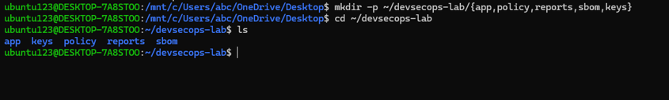
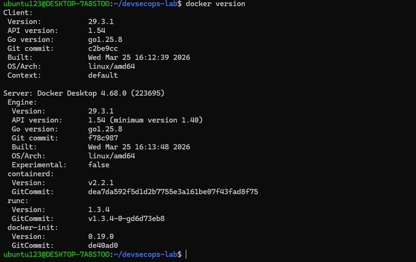
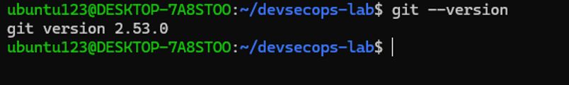
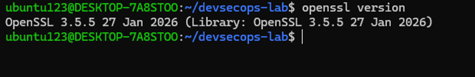
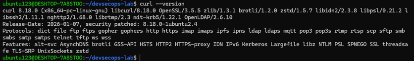
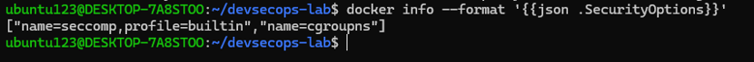
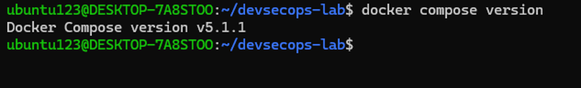

# Bab 1 — Fondasi Teoretis dan Kerangka Kerja DevSecOps

| | |
| --- | --- |
| **Nama** | `Arsyita Devanaya Arianto` |
| **NIM** | `3126640046` |
| **Kelas** | `D4 RPL IT B` |

---

## 1. Tujuan dan Ruang Lingkup

Praktikum ini bertujuan untuk:

1. Menjelaskan DevSecOps sebagai sistem sosio-teknis, bukan sekadar penambahan pemindai ke dalam pipeline.
2. Memetakan praktik DevSecOps ke kelompok praktik NIST SSDF, panduan OWASP, dan jaminan rantai pasok SLSA.
3. Membedakan shift-left, shift-right, security gate, waiver berbasis risiko, serta evidence yang dapat diaudit.
4. Menyusun baseline laboratorium dan parameter lingkungan agar seluruh eksperimen pada bab berikutnya dapat direproduksi.

Ruang lingkup Bab 1 adalah landasan teori serta pembentukan lingkungan kerja: pembuatan direktori proyek, pencatatan versi komponen (Docker Engine, Docker Compose, Git, OpenSSL, curl), pencatatan `SecurityOptions` daemon Docker, dan penyusunan threat statement awal.

## 2. Landasan Teori

### 2.1 Transformasi Digital dan Business Agility

Transformasi digital tidak tepat dimaknai hanya sebagai pemindahan proses manual ke aplikasi, melainkan perubahan cara organisasi menciptakan nilai dengan menjadikan data, aplikasi, dan infrastruktur sebagai satu sistem. Business agility adalah kemampuan organisasi mendeteksi perubahan, menentukan prioritas, menguji respons, dan mengalirkan hasilnya ke pengguna dalam waktu yang relevan. Agility mensyaratkan siklus belajar yang pendek, umpan balik yang dapat dipercaya, dan kemampuan membatalkan atau memperbaiki keputusan tanpa biaya yang tidak proporsional.

### 2.2 Evolusi Waterfall → Agile → DevOps

| Pendekatan | Unit Perubahan | Umpan Balik | Otomasi Dominan | Risiko Utama |
| --- | --- | --- | --- | --- |
| Waterfall | Tahap atau rilis besar | Cenderung terlambat | Terbatas per tahap | Asumsi awal mahal dikoreksi |
| Agile | Increment per sprint | Review setiap iterasi | Build/test dapat parsial | Rilis tetap menjadi antrean operasi |
| DevOps | Perubahan kecil dan sering | Pipeline dan telemetry | CI/CD, IaC, observability | Kecepatan menyebarkan salah konfigurasi |
| DevSecOps | Perubahan kecil + evidence | Risiko dari desain hingga runtime | Kontrol keamanan sebagai kode | Gate buruk memicu bypass/bottleneck |

DevOps memperluas prinsip iteratif ke seluruh aliran delivery. Continuous Integration (CI) mengintegrasikan dan memverifikasi perubahan kecil secara sering; Continuous Delivery (CD) menjaga perangkat lunak selalu siap dirilis; Continuous Deployment menerapkan perubahan yang lolos kebijakan secara otomatis. Ukuran batch yang kecil merupakan mekanisme utama: perubahan kecil lebih mudah ditinjau, diuji, dilacak, dan dikembalikan.

### 2.3 DevOps sebagai Sistem Sosio-Teknis

DevOps bukan sekadar pipeline CI/CD. Hasil delivery dibentuk oleh interaksi manusia, proses, arsitektur, alat, dan kebijakan. Siklus devops direpresentasikan sebagai plan–code–build–test–release–deploy–operate–monitor yang tidak berujung; observability menjadi mekanisme pembelajaran organisasi. Continuous testing disusun berlapis: linting, unit test, secret scanning, dan policy check dijalankan lebih awal; integration test serta analisis dependensi setelah build; pengujian yang memerlukan lingkungan (misalnya DAST) ditempatkan pada staging terisolasi.

### 2.4 DevSecOps, Risiko, dan Evidence

DevSecOps mengintegrasikan keamanan ke dalam keputusan, alur kerja, otomasi, dan tanggung jawab sepanjang siklus hidup sistem. Prinsip utamanya:

- **Shared responsibility** — akuntabilitas terhadap hasil dibagi, bukan semua orang mengerjakan seluruh tugas keamanan. Pembagian peran tetap ada (product owner, developer, platform engineer, security engineer, operator, auditor) dengan bantuan RACI, security champion, review dua orang, dan escalation path.
- **Shift-left** — umpan balik keamanan sedini mungkin (linting Dockerfile, secret scanning pre-commit, SAST pada pull request, SCA, threat modeling pada desain).
- **Shift-right** — melengkapi shift-left melalui DAST, monitoring, runtime detection, verification saat deploy, dan pembelajaran pascainsiden.
- **Security gate** — keputusan kebijakan berbasis hasil pemeriksaan dengan input terdefinisi, threshold transparan, output mesin yang disimpan, waiver berbatas waktu dengan pemilik, serta jalur remediasi. Gate terlalu ketat mendorong tim menonaktifkan alat; gate terlalu longgar menciptakan kesan aman palsu.
- **Manajemen risiko** — severity CVE tidak identik dengan risiko organisasi; risiko dipengaruhi keterpaparan, exploitability, nilai aset, kontrol kompensasi, dan dampak bisnis. Hasil scan diperlakukan sebagai evidence untuk keputusan, bukan keputusan itu sendiri.
- **Evidence as product** — hasil keamanan (SARIF, JUnit XML, SBOM, attestations, hasil policy evaluation, log deployment) dapat ditelusuri ke commit, pipeline run, image digest, tool version, konfigurasi rule, dan keputusan waiver. Screenshot tidak cukup sebagai sumber kebenaran.

Kerangka kerja yang digunakan: NIST SSDF (v1.1, SP 800-218) sebagai kosakata tata kelola, OWASP DevSecOps Guideline/SAMM untuk teknik implementasi, serta SLSA untuk tingkat jaminan rantai pasok (SBOM, digest, signature, provenance).

## 3. Pelaksanaan Praktikum

### 3.1 Pembuatan Direktori Kerja dan Pencatatan Versi

```bash
mkdir -p ~/devsecops-lab/{app,policy,reports,sbom,keys}
cd ~/devsecops-lab
```



##### Keterangan:

- `mkdir:` Perintah untuk membuat direktori (folder) baru di Linux.
- `Opsi -p (parents):` Memastikan pembuatan direktori induk jika belum ada, serta mencegah error apabila direktori sudah pernah dibuat sebelumnya.
- `Sintaks Kurung Kurawal {app,policy,reports,sbom,keys}:` Brace expansion pada shell Bash untuk membuat 5 sub-direktori sekaligus dalam satu baris perintah.
- `~/:` Merujuk pada home directory pengguna saat ini (misalnya /home/praktikan).
- `cd ~/devsecops-lab:` Mengubah direktori kerja aktif shell ke folder laboratorium yang baru saja dibuat.


```bash
docker version
```


- `Fungsi:` Menampilkan versi lengkap dari Docker Engine, baik sisi Client maupun Server (Daemon).
- `Mengapa Detail Ini Penting:` Hasil scan kerentanan container sangat bergantung pada versi runtime Docker yang digunakan.

```bash
docker compose version
```


- `Fungsi:` Memeriksa apakah utilitas orkestrasi Docker Compose telah terpasang dan memastikan versi yang aktif adalah v2 (berbentuk plugin terintegrasi docker compose, bukan skrip v1 terdahulu docker-compose).

```bash
git --version
```


- `Fungsi:` Memeriksa versi Version Control System (VCS) Git.
- `Mengapa Detail Ini Penting:` Diperlukan untuk memastikan fitur audit jejak commit dan pengintegrasian skrip otomatisasi pipeline bekerja sesuai ekspektasi.

```bash
openssl version
```


- `Fungsi:` Menampilkan versi pustaka dan alat perintah OpenSSL pada sistem host.
- `Mengapa Detail Ini Penting:` Digunakan untuk mengonfirmasi pustaka kriptografi yang akan menangani enkripsi, dekripsi, serta pembuatan sertifikat/kunci keamanan.

```bash
curl --version
```


- `Fungsi:` Menampilkan versi utilitas pengirim request HTTP/HTTPS curl beserta pustaka enkripsi yang didukungnya (seperti OpenSSL/LibreSSL).
- `Mengapa Detail Ini Penting:` Menguji ketersediaan utilitas untuk keperluan API security testing atau pengunduhan skrip otomatisasi.

```bash
docker info --format '{{json .SecurityOptions}}'
```


##### Keterangan
- `docker info:` Mengambil metrik teknis dan informasi tingkat tinggi mengenai konfigurasi sistem serta Docker Daemon.
- `Opsi --format '{{json .SecurityOptions}}':` Menggunakan Go template untuk memfilter output dan hanya menampilkan nilai atribut SecurityOptions dalam format JSON yang mudah dibaca.

### 3.2 Hasil Eksekusi

| Perintah | Hasil / Catatan |
| --- | --- |
| `docker version` |  |
| `docker compose version` |  |
| `git --version` |  |
| `openssl version` |  |
| `curl --version` |  |
| `docker info --format '{{json .SecurityOptions}}'` |  |

## 4. Jawaban Evaluasi & Latihan Mandiri
### 4.1 Mengapa DevSecOps tidak dapat direduksi menjadi penambahan scanner pada pipeline?
Scanner hanyalah alat bantu teknis. DevSecOps mencakup integrasi budaya, tata kelola, arsitektur sistem, serta pengelolaan risiko secara berkelanjutan. Menambahkan scanner tanpa proses triase temuan, kejelasan kepemilikan risiko (ownership), dan budaya perbaikan otomatis hanya akan menghasilkan tumpukan false positive yang menghambat proses rilis aplikasi.

### 4.2 Evidence apa yang membedakan klaim kontrol dari kontrol yang benar-benar terverifikasi?
Klaim kontrol hanya berupa pernyataan kebijakan (misal: "Container tidak boleh berjalan sebagai root"). Kontrol terverifikasi membutuhkan evidence berwujud log konfigurasi aktual, laporan automated compliance scan, identitas mesin/engine penguji, serta versi rule set yang digunakan saat pemindaian dilakukan.

### 4.3 Bagaimana shared responsibility memengaruhi ownership risiko dan tindak lanjut temuan?
Shared responsibility membagi batasan tanggung jawab secara jelas antara tim platform/infrastruktur (keamanan host, daemon, dan runtime) dengan tim pengembang (keamanan kode, library, dan dependensi). Pembagian ini memastikan setiap temuan kerentanan memiliki penanggung jawab spesifik untuk melakukan remedi tanpa saling melempar tanggung jawab.

## 5. Kesimpulan

Praktikum ini berhasil menetapkan baseline laboratorium DevSecOps pada lingkungan host WSL2/Ubuntu. Perekaman versi engine/tooling dan pencatatan kapabilitas SecurityOptions (seccomp dan cgroupns) memberikan acuan baku untuk menjamin keterulangan (reproducibility) serta validitas pengujian keamanan pada tahapan praktikum berikutnya.
