# Bab 2 — Konsep Container dan Instalasi Docker

| | |
| --- | --- |
| **Nama** | `Arsyita Devanaya Arianto` |
| **NIM** | `3126640046` |
| **Kelas** | `D4 RPL IT B` |


---

## 1. Tujuan dan Ruang Lingkup

Praktikum Bab 2 bertujuan untuk:

1. Menjelaskan perbedaan virtual machine dan container dari sisi isolasi, ukuran, startup time, dan overhead.
2. Mengidentifikasi komponen Docker: client, daemon, registry, image, container, network, dan volume.
3. Menginstal Docker Engine pada Ubuntu serta memahami struktur instalasi pada Windows berbasis WSL2.
4. Menjalankan container pertama, melakukan inspeksi image, melihat log, dan membangun image custom sederhana.

Ruang lingkup bab ini mencakup instalasi Docker Engine (client, daemon, containerd, buildx, dan compose plugin), uji `docker run hello-world`, eksperimen container Nginx dan Ubuntu interaktif, serta pembangunan image custom web statis berbasis `nginx:1.26-alpine`.

## 2. Landasan Teori

### 2.1 Containerization dan Perbandingan dengan Virtual Machine

Container bukan komputer virtual yang memiliki kernel sendiri, melainkan sekumpulan proses biasa pada host yang memperoleh pandangan resource berbeda melalui namespace, pembatasan resource melalui cgroup, dan pengurangan privilege melalui mekanisme keamanan kernel. Container berbagi kernel host sehingga umumnya lebih kecil, lebih cepat dimulai, dan lebih ringan, tetapi boundary keamanannya tidak sama dengan boundary hypervisor. Portabilitas image juga tidak mutlak; image Linux amd64 tidak otomatis berjalan native pada host arm64 tanpa varian multi-platform atau emulasi.

| Aspek | Virtual Machine | Container |
| --- | --- | --- |
| Kernel | Setiap VM membawa guest OS sendiri | Berbagi kernel host |
| Ukuran image | Umumnya GB | Umumnya MB hingga ratusan MB |
| Startup | Detik hingga menit | Umumnya detik atau kurang |
| Isolasi | Lebih kuat karena boundary hypervisor | Lebih ringan, perlu hardening runtime |
| Use case | Multi-OS, isolasi kuat, workload legacy | Dev/test, microservices, CI/CD, scaling cepat |

### 2.2 Namespace, cgroup, dan Mekanisme Isolasi

| Mekanisme | Objek yang Diatur | Peran pada Container | Batasan |
| --- | --- | --- | --- |
| PID namespace | Nomor dan visibilitas proses | Membentuk pohon proses tersendiri | Tidak membatasi CPU atau memori |
| Mount namespace | Tampilan mount point dan filesystem | Memberi root filesystem serta mount terpisah | Bind mount tetap dapat membuka data host |
| Network namespace | Interface, alamat, route, port, firewall | Membentuk network stack logis per container | Konektivitas tetap ditentukan bridge dan policy host |
| User namespace | Pemetaan UID dan GID | Memetakan root di container ke ID non-root host | Kompatibilitas workload perlu diuji |
| cgroup v2 | CPU, memori, I/O, jumlah proses | Mengukur dan membatasi konsumsi resource | Bukan pemisah visibilitas atau hak akses |
| Capabilities/seccomp/LSM | Privilege, system call, dan kebijakan akses | Mengurangi kemampuan proses ketika dieksploitasi | Harus disesuaikan dengan kebutuhan aplikasi |

### 2.3 Image, Layer, dan Standar OCI

Image adalah template read-only yang memuat filesystem dan metadata, tersusun atas layer dengan strategi copy-on-write: banyak container dapat berbagi layer read-only dan hanya menyimpan perubahan lokal pada writable layer. Open Container Initiative menstandardisasi Image Specification, Runtime Specification, dan Distribution Specification sehingga image dan runtime tidak terikat pada satu vendor. Karena image bersifat content-addressable, tag hanyalah nama yang dapat dipindahkan; reproduksibilitas yang kuat memerlukan pinning terhadap tag spesifik atau digest, dengan pemeliharaan pin secara sadar ketika base image menerima perbaikan keamanan.

### 2.4 Arsitektur Docker dan Model Keamanan Container

Arsitektur runtime modern memisahkan client, daemon, containerd, dan low-level runtime (runc) sesuai OCI Runtime Specification. Kegagalan command CLI dapat berakar pada konektivitas API, daemon, download image, snapshot storage, runtime, maupun proses aplikasi — karena itu troubleshooting harus berlapis. Keamanan container dianalisis pada empat wilayah: isolasi kernel, attack surface daemon, konfigurasi container, dan fitur hardening kernel (capabilities, seccomp, AppArmor/SELinux, read-only filesystem, rootless mode). Keanggotaan group `docker` pada praktiknya setara akses root karena memungkinkan menjalankan container privileged atau memasang filesystem host, sehingga bukan mekanisme least privilege.

### 2.5 Dockerfile, Build Cache, dan Reproduksibilitas

Dockerfile adalah spesifikasi build deklaratif dengan konsekuensi terhadap layer, cache, ukuran, dan keamanan. Urutan instruksi yang stabil meningkatkan reuse cache; `.dockerignore` membatasi build context agar file rahasia tidak terkirim ke builder; multi-stage build memisahkan lingkungan kompilasi dari runtime sehingga meminimalkan ukuran image dan attack surface. Build reproducible memerlukan lebih dari Dockerfile yang sama: base image, arsitektur, build argument, lockfile dependency, dan toolchain harus direkam; cache hit bukan bukti dependency masih aman atau terbaru.

### 2.6 Sintesis Konsep Inti

Container adalah isolasi proses berbasis kernel yang membingkai aplikasi beserta dependensinya. Docker Engine menyediakan daemon yang mengelola lifecycle image dan container melalui API. Dockerfile adalah resep deklaratif untuk membangun image; praktik awal yang baik adalah memakai base image spesifik, menyalin dependensi sebelum source code, menjalankan proses sebagai non-root, dan menghindari secret dalam image.

## 3. Pelaksanaan Praktikum

### 3.1 Instalasi Docker Engine pada Ubuntu

```bash
sudo apt update
sudo apt install -y ca-certificates curl gnupg lsb-release
sudo install -m 0755 -d /etc/apt/keyrings
curl -fsSL https://download.docker.com/linux/ubuntu/gpg | \
  sudo gpg --dearmor -o /etc/apt/keyrings/docker.gpg
sudo chmod a+r /etc/apt/keyrings/docker.gpg
echo "deb [arch=$(dpkg --print-architecture) signed-by=/etc/apt/keyrings/docker.gpg] \
  https://download.docker.com/linux/ubuntu $(lsb_release -cs) stable" | \
  sudo tee /etc/apt/sources.list.d/docker.list > /dev/null
sudo apt update
sudo apt install -y docker-ce docker-ce-cli containerd.io docker-buildx-plugin docker-compose-plugin
sudo usermod -aG docker $USER
newgrp docker
docker version
docker run hello-world
```
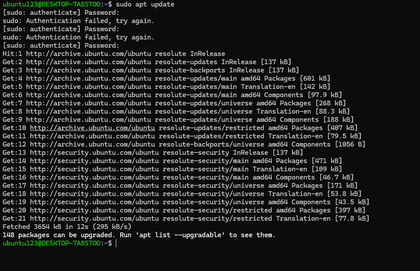
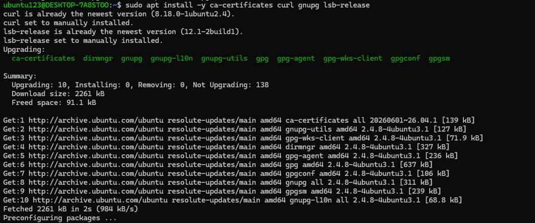
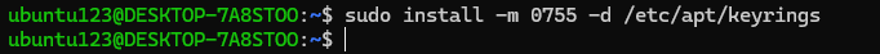
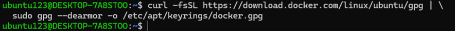
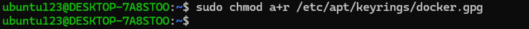
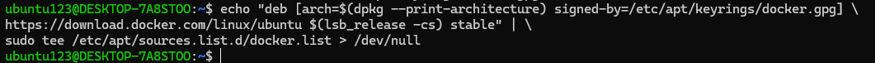
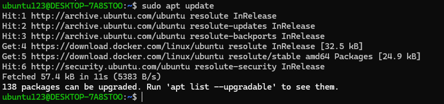
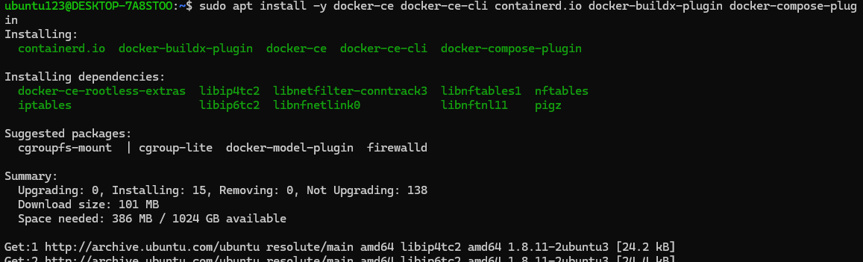
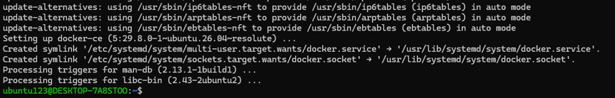
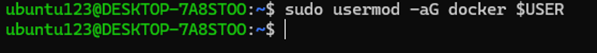
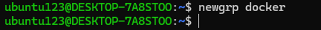
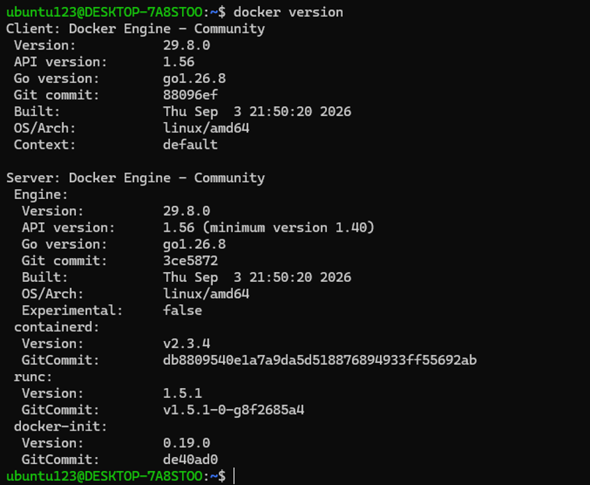


### 3.2 Container Nginx dan Ubuntu Interaktif

```bash
docker pull nginx:1.26
docker run -d --name web-public -p 8080:80 nginx:1.26
docker ps
docker logs --tail 20 web-public
curl http://localhost:8080
docker run -it --name ubuntu-test ubuntu:22.04 /bin/bash
cat /etc/os-release
exit
docker rm -f web-public ubuntu-test
```
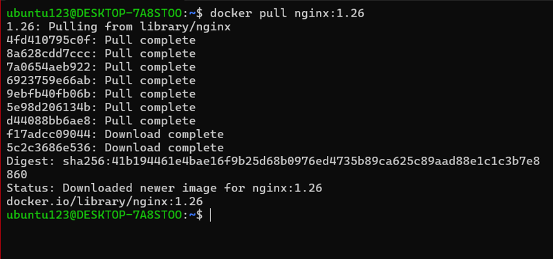
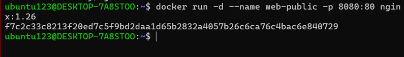
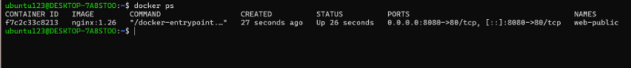
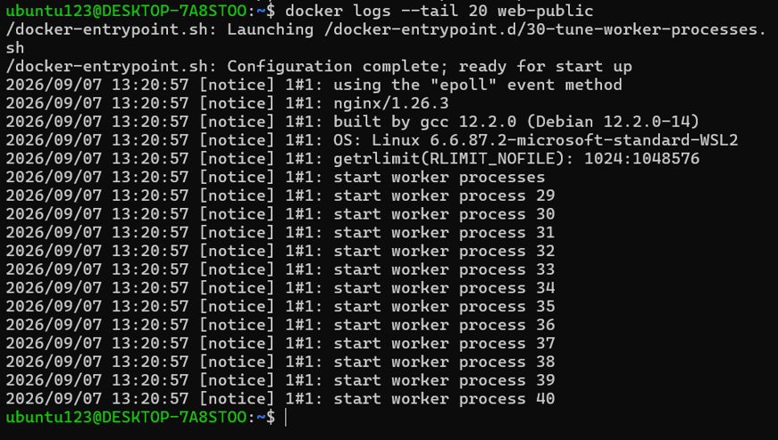
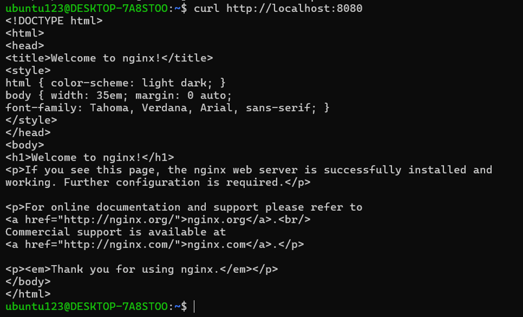
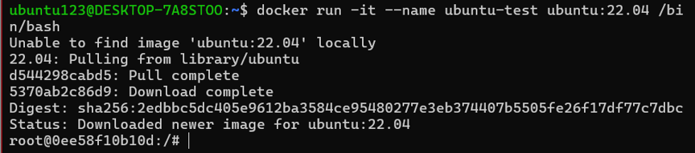
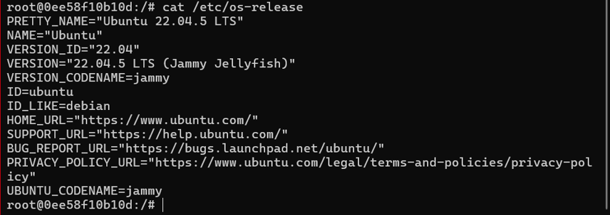
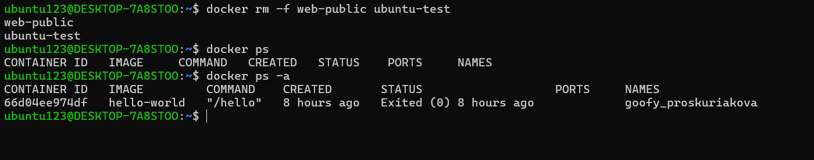

### 3.3 Pembangunan Image Custom Web Statis

```bash
mkdir -p ~/docker-lab/custom-web && cd ~/docker-lab/custom-web
cat > index.html << 'EOF'
<h1>Docker Lab PENS</h1>
<p>Container berhasil berjalan.</p>
EOF
cat > Dockerfile << 'EOF'
FROM nginx:1.26-alpine
LABEL maintainer="admin@pens.ac.id"
COPY index.html /usr/share/nginx/html/index.html
EXPOSE 80
CMD ["nginx", "-g", "daemon off;"]
EOF
docker build -t pens-web:1.0 .
docker run -d --name pens-app -p 9090:80 pens-web:1.0
curl http://localhost:9090
```

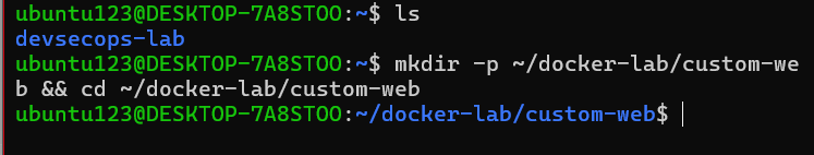
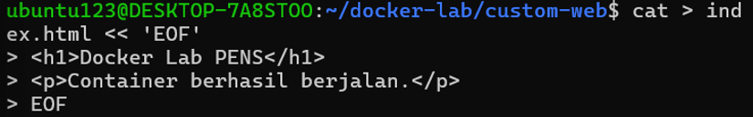
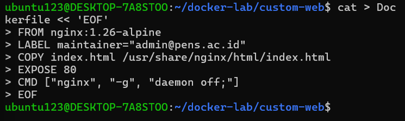

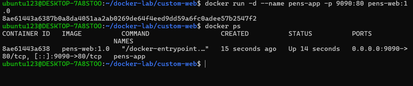
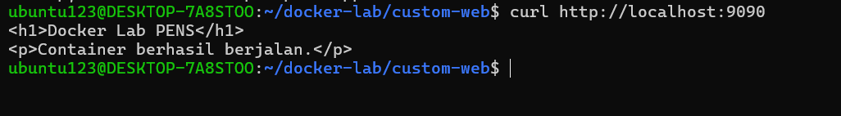

### 3.4 Hasil Eksekusi

| Perintah | Hasil / Catatan | Status |
| --- | --- | --- |
| `docker version` | 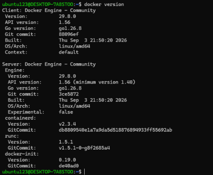 | `PASS` |
| `docker run hello-world` | 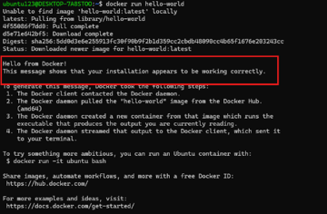 | `PASS` |
| `docker ps` (container `web-public`) |  | `PASS` |
| `curl http://localhost:8080` (browser) | 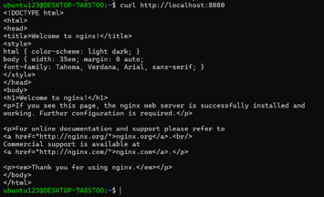 | `PASS` |
| `docker logs --tail 20 web-public` |  | `PASS` |
| `docker build -t pens-web:1.0 .` | 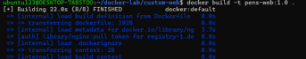 | `PASS` |
| `curl http://localhost:9090` |  | `PASS` |

## 4. Analisis Wajib

### 4.1 Jelaskan satu masalah yang muncul dan cara Anda mendiagnosisnya.

- `Masalah:` Pada Langkah 2.2 Point 4, saat memeriksa docker logs web-public, Nginx spawn hingga 11 worker process (worker process 30 hingga 40). 
- `Diagnosis:` Hal ini terjadi karena konfigurasi default Nginx (worker_processes auto;) membaca seluruh virtual CPU core yang dialokasikan oleh Hyper-V/WSL2 dari host Windows. Untuk container web server sederhana di lingkungan pengujian, alokasi worker process yang terlalu banyak ini membuang-buang memori (resource waste).

### 4.2 Jelaskan risiko keamanan atau operasional yang relevan pada bab ini.

- `Keamanan:`
  - Root Privilege: Container berjalan menggunakan akun default root bawaan image nginx:1.26-alpine yang berisiko jika terjadi container escape.  
  - Akses Grup Docker: Penambahan pengguna ke grup docker (usermod -aG docker) memberikan akses setara root pada host melalui soket Docker.  
  - Lalu Lintas Unencrypted: Layanan HTTP terbuka pada port unencrypted (80/8080/9090) tanpa TLS/SSL.
- `Operasional:`
  - Resource Spikes: Tidak adanya batasan CPU/RAM pada perintah docker run berisiko memicu crash pada host jika terjadi memory leak.  
  - Penghentian Paksa: Penggunaan docker rm -f berpotensi memutus proses/sesi yang sedang berjalan secara tidak aman (non-graceful shutdown).

### 4.3 Berikan rekomendasi perbaikan bila lab ini akan dibawa ke production-like environment.

- User Non-Root: Konfigurasi Dockerfile agar layanan berjalan di bawah ID pengguna non-root (misal USER 1001).
- Resource Limit: Tambahkan parameter pembatas alokasi memori dan CPU saat deployment (contoh: --memory="256m" --cpus="0.5").
- Enkripsi & TLS: Gunakan Reverse Proxy (Nginx/Traefik) dengan sertifikat SSL/TLS untuk enkripsi HTTPS.
- Scan Image (DevSecOps): Integrasikan pemindaian kerentanan image (seperti Trivy atau Grype) pada CI/CD pipeline.

## 5. Kesimpulan

Praktikum Bab 2 menyelesaikan instalasi Docker Engine pada Ubuntu, menjalankan container pertama, melakukan inspeksi image, melihat log, dan membangun image custom. Hasil memperlihatkan bahwa container adalah mekanisme isolasi proses yang berbagi kernel host, sehingga ringan dan cepat, tetapi boundary keamanannya bergantung pada konfigurasi namespace, cgroup, capabilities, dan kebijakan akses daemon. Penggunaan tag spesifik, proses non-root, penghindaran secret pada layer, serta pencatatan ingest dibuktikan sebagai praktik dasar yang menjadi fondasi untuk eksperimen network, storage, dan Compose pada bab berikutnya. Bukti eksekusi, kendala yang ditemui, dan refleksi keamanan/operasional terdokumentasi pada bagian verifikasi dan analisis.