# Bab 3 — Docker Network, Volume, Bind Mount, tmpfs, dan Compose

| | |
| --- | --- |
| **Nama** | `Arsyita Devanaya Arianto` |
| **NIM** | `3126640046` |
| **Kelas** | `D4 RPL IT B` |

---

## 1. Tujuan dan Ruang Lingkup

Praktikum Bab 3 bertujuan untuk:

1. Membuat user-defined bridge network dan membuktikan name resolution antar container.
2. Membedakan volume, bind mount, dan tmpfs dari sisi persistensi, portabilitas, dan keamanan.
3. Menulis file Compose untuk aplikasi multi-container yang memiliki service, network, volume, dan healthcheck.
4. Mengelola lifecycle aplikasi dengan `docker compose up`, `ps`, `logs`, `stop`, `start`, `down`, dan `down -v`.

Ruang lingkup bab ini mencakup eksperimen user-defined bridge network, pembuatan dan restore volume (backup `data-vol`), serta stack Compose Nginx–Flask–PostgreSQL dengan segmentasi network dan healthcheck.

## 2. Landasan Teori

### 2.1 Network sebagai Graf Keterjangkauan

Jaringan container membentuk graf keterjangkauan antarkomponen, bukan sekadar pemberi alamat IP. Network frontend menghubungkan reverse proxy dengan aplikasi, sedangkan network backend menghubungkan aplikasi dengan database; database tidak perlu bergabung ke frontend dan umumnya tidak perlu memublikasikan port ke host. Pemodelan ini mengurangi jalur serangan sekaligus memperjelas dependensi komunikasi.

### 2.2 User-Defined Bridge, DNS, dan Identitas Service

User-defined bridge menyediakan isolasi yang lebih baik dan resolusi DNS otomatis berbasis nama container atau nama service. Identitas logis (misalnya `db:5432` atau `app:5000`) lebih stabil daripada alamat IP yang dapat berubah ketika container dibuat ulang. Nama service bukan mekanisme autentikasi: DNS internal membantu discovery, tetapi tidak membuktikan identitas cryptographic peer dan tidak mengenkripsi lalu lintas. Network segmentation juga tidak menggantikan authorization; service yang terhubung ke dua zona tetap menjadi jalur sah yang dapat digunakan penyerang apabila service dikompromikan.

### 2.3 Port Publishing, NAT, dan Firewall Host

Opsi `-p HOST_PORT:CONTAINER_PORT` membuat aturan pada host agar traffic diteruskan menuju port container; komunikasi service-to-service menggunakan port container, bukan host port. Publikasi tanpa alamat bind (`-p 8080:80`) dapat mengikat seluruh interface host, sedangkan `-p 127.0.0.1:8080:80` membatasinya ke loopback. Perubahan manual pada iptables/nftables tanpa memahami chain Docker dapat menghasilkan policy yang tampak benar tetapi tidak berlaku pada traffic container; validasi harus dilakukan dari sumber jaringan yang relevan.

### 2.4 Lifecycle Data dan Pemilihan Mount

| Mekanisme | Persistensi | Ketergantungan Host | Kasus Penggunaan | Risiko Utama |
| --- | --- | --- | --- | --- |
| Writable layer | Hilang saat container dihapus | Rendah | Data sementara kecil | Sulit di-backup; CoW overhead |
| Named volume | Melampaui lifecycle container | Rendah-sedang | Database dan data aplikasi | Salah hapus; backup/restore belum otomatis |
| Bind mount | Mengikuti file host | Tinggi | Source, konfigurasi, artefak dev | Container dapat mengubah host; path tidak portabel |
| tmpfs | Hilang saat stop/restart | Linux dan memori host | Cache atau data temporer sensitif | Konsumsi RAM; bukan penyimpanan tahan lama |
| Compose secret | Selama deployment; sumber eksternal tetap ada | Bergantung sumber file/env | Password, token, certificate | Proteksi sumber dan permission tetap wajib |

Persistent tidak sama dengan protected: volume dapat terhapus melalui `down -v` atau `prune`, mengalami korupsi, dan tidak otomatis memiliki backup. Bind mount memiliki akses tulis secara default sehingga opsi `:ro` harus dipakai bila write tidak diperlukan; mount ke direktori container yang telah berisi file akan menutupi isi tersebut selama mount aktif. tmpfs menyimpan data di memori host, cocok untuk cache atau data temporer sensitif, tetapi menghabiskan RAM dan tidak untuk data yang harus bertahan.

### 2.5 Compose sebagai Model Aplikasi Deklaratif

Docker Compose menyatakan model aplikasi multi-container dalam YAML dengan elemen `services`, `networks`, `volumes`, `configs`, dan `secrets`. Perintah `docker compose config` digunakan untuk memvalidasi model akhir setelah interpolation dan merge. Project name menjadi prefix network, volume, dan container. `up` merekonsiliasi keadaan aktual dengan model, `stop` menghentikan container tanpa menghapusnya, sedangkan `down` menghapus container dan network proyek; `down -v` bersifat destruktif karena turut menghapus volume. `depends_on` dengan `condition: service_healthy` menunggu dependency benar-benar siap, tidak sekadar dimulai.

### 2.6 Konfigurasi, Environment, dan Secret

Environment variable membantu memisahkan konfigurasi dari image, tetapi berpotensi terlihat melalui inspect, process environment, log, atau crash report; `.env` terutama merupakan sumber interpolation dan tidak otomatis aman untuk credential. Compose secret diberikan hanya pada service yang memerlukan dan tersedia sebagai file di `/run/secrets`. Password yang dipakai di laboratorium bersifat sintetis untuk lingkungan disposable; pada environment production-like, password tidak boleh dikomit ke repository dan harus dikelola oleh secret manager atau file secret dengan permission terbatas.

### 2.7 Sintesis Konsep Inti

| Tipe mount | Lokasi | Persisten | Kapan digunakan |
| --- | --- | --- | --- |
| Volume | Dikelola Docker di /var/lib/docker/volumes | Ya | Database, data aplikasi, artifact jangka panjang |
| Bind mount | Path host yang ditentukan user | Ya | Live development, file konfigurasi host |
| tmpfs | RAM host | Tidak | Cache sementara, secret lab, file sensitif sementara |

## 3. Metodologi

Laboratorium menggunakan satu host yang menjalankan Docker Engine dan Compose v2 dengan direktori kerja `~/docker-lab/bab-3`. Setiap sub-langkah dijalankan berurutan dan diverifikasi sebelum lanjut. Perintah cleanup dijalankan setelah praktikum, terutama karena port yang sama dapat digunakan bab berikutnya. Kredensial database pada stack Compose menggunakan nilai sintetis yang di-redact pada laporan ini.

## 4. Pelaksanaan Praktikum

### 4.1 User-Defined Bridge Network

```bash
docker network create --driver bridge --subnet 172.20.0.0/16 lab-net
docker run -d --name server-a --network lab-net nginx:alpine
docker run -d --name server-b --network lab-net nginx:alpine
docker exec server-a ping -c 3 server-b
docker rm -f server-a server-b
```
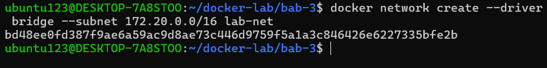
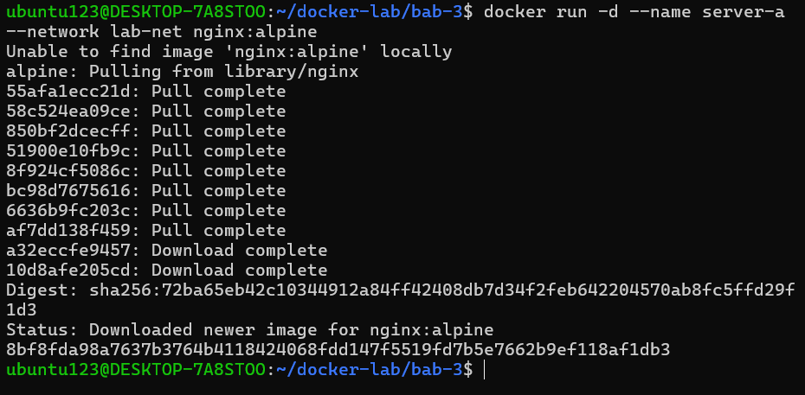
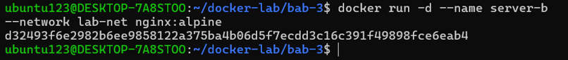
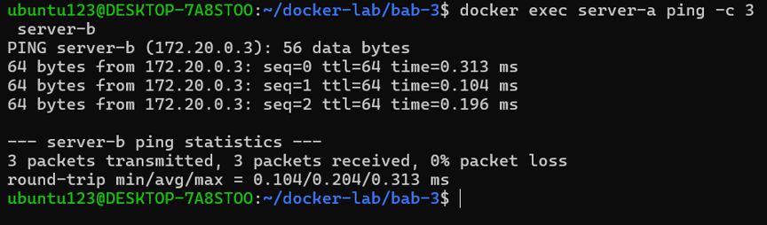
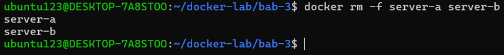

### 4.2 Volume Backup dan Restore

```bash
docker volume create data-vol
docker run -d --name writer -v data-vol:/app/data alpine:3.20 \
  sh -c "while true; do date >> /app/data/log.txt; sleep 5; done"
sleep 15
docker rm -f writer
docker run --rm -v data-vol:/data alpine:3.20 cat /data/log.txt
docker run --rm -v data-vol:/source:ro -v $(pwd):/backup alpine:3.20 \
  tar czf /backup/data-vol-backup.tar.gz -C /source .
```
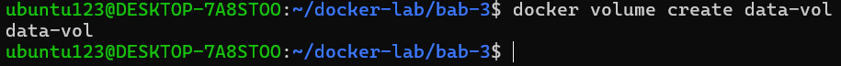
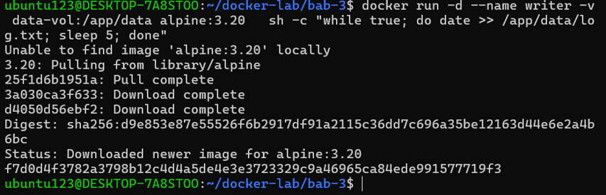
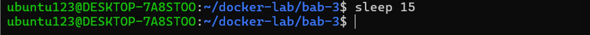
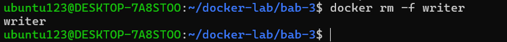
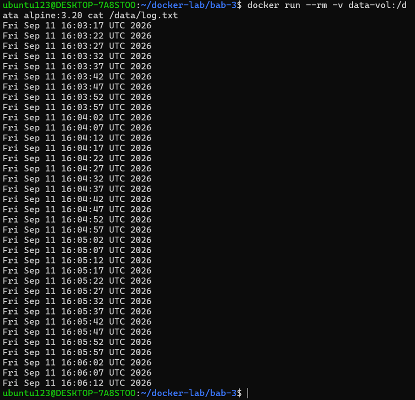
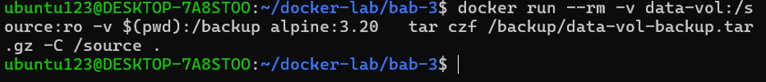

### 4.3 Compose Multi-Container Nginx–Flask–PostgreSQL

```yaml
services:
  web:
    image: nginx:alpine
    ports:
      - "8080:80"
    volumes:
      - ./html:/usr/share/nginx/html:ro
      - ./nginx.conf:/etc/nginx/conf.d/default.conf:ro
    networks: [frontend]
    depends_on: [app]
  app:
    build: ./app
    environment:
      DB_HOST: db
      DB_NAME: labdb
      DB_USER: labuser
      DB_PASS: <REDACTED>
    networks: [frontend, backend]
    depends_on:
      db:
        condition: service_healthy
  db:
    image: postgres:16-alpine
    environment:
      POSTGRES_DB: labdb
      POSTGRES_USER: labuser
      POSTGRES_PASSWORD: <REDACTED>
    volumes:
      - pg-data:/var/lib/postgresql/data
    networks: [backend]
    healthcheck:
      test: ["CMD-SHELL", "pg_isready -U labuser -d labdb"]
      interval: 5s
      timeout: 5s
      retries: 5
volumes:
  pg-data:
networks:
  frontend:
  backend:
```
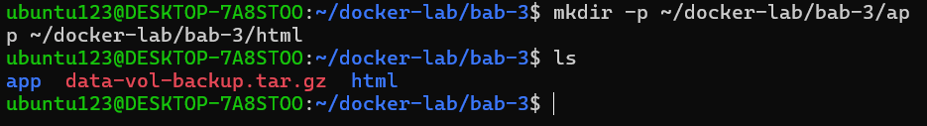
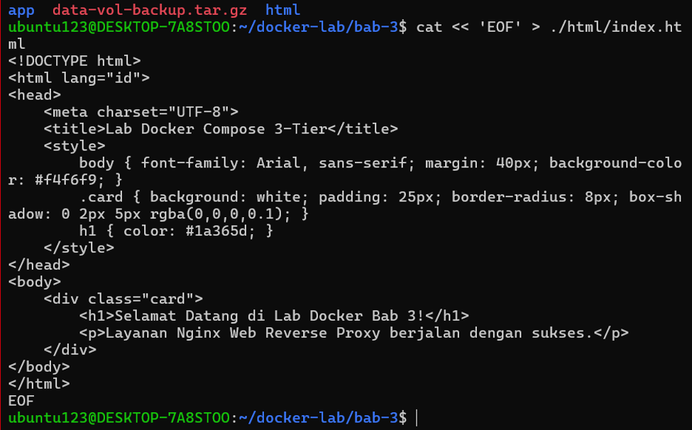
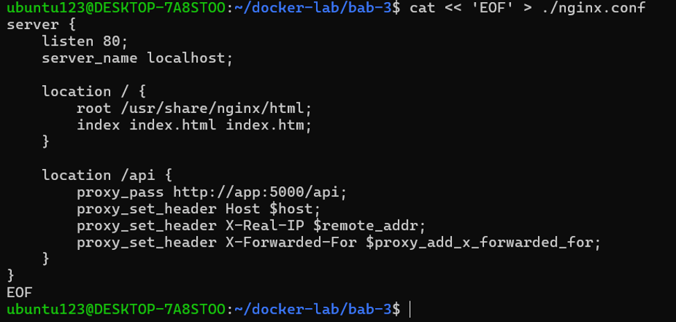
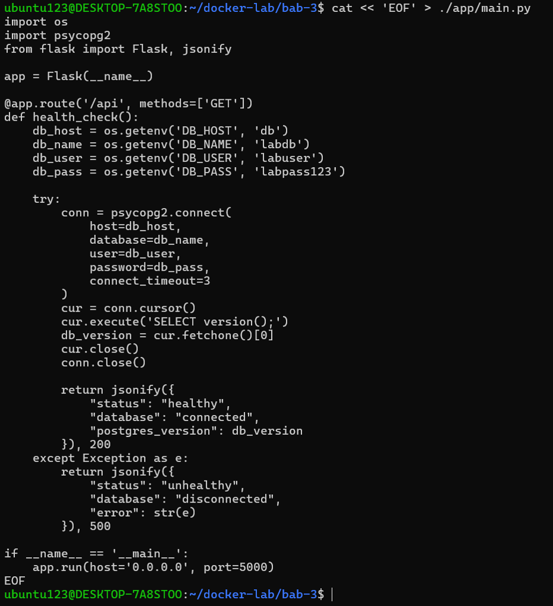
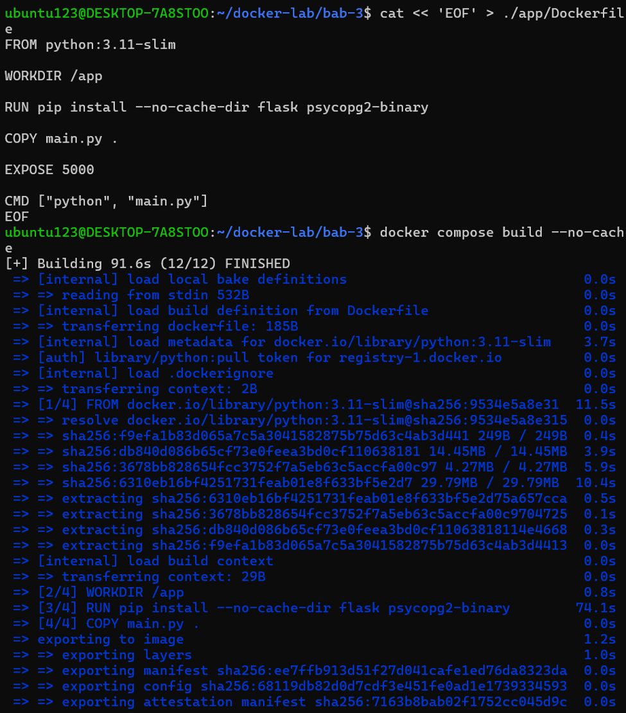
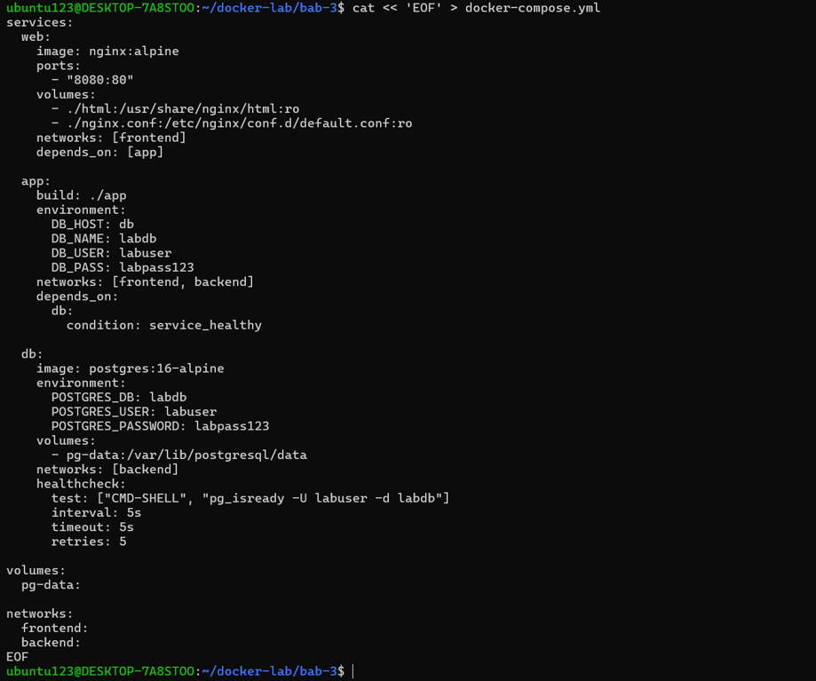
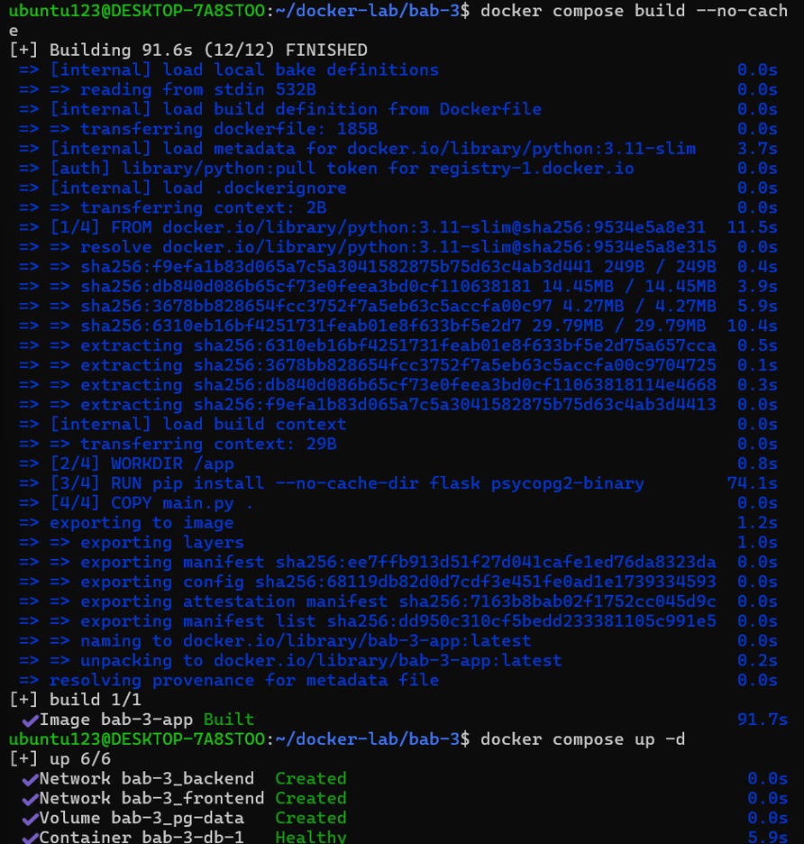

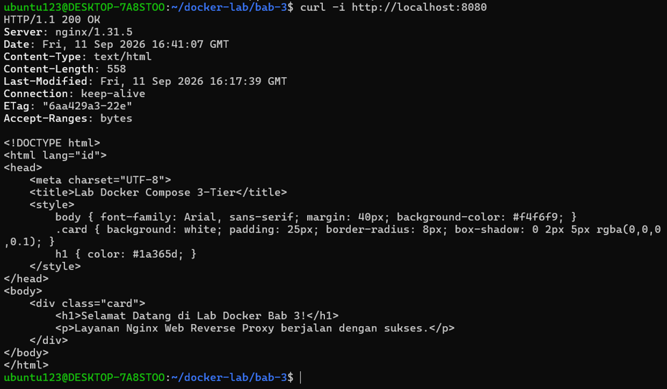
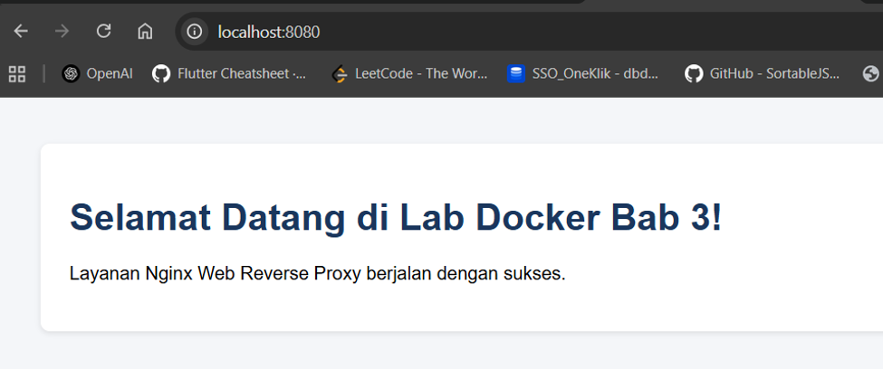
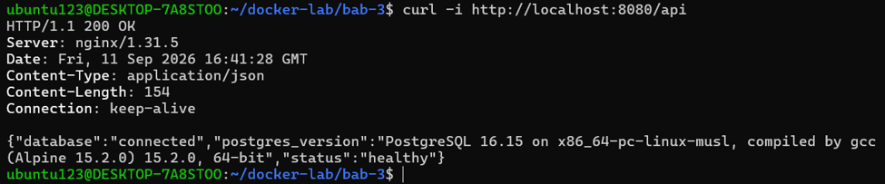
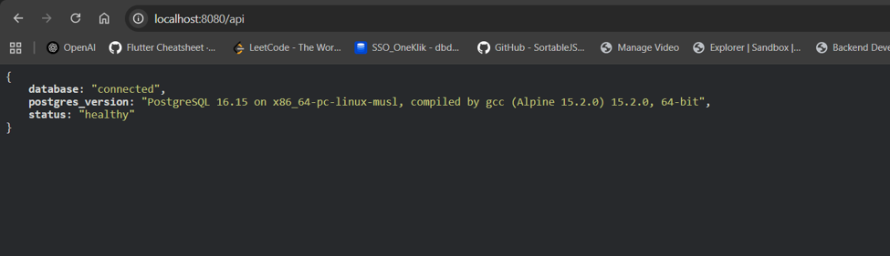

### 4.4 Hasil Eksekusi

| Perintah | Hasil / Catatan | Status |
| --- | --- | --- |
| `docker network create ... lab-net` |  | `PASS` |
| `docker exec server-a ping -c 3 server-b` |  | `PASS` |
| `docker run --rm -v data-vol:/data alpine:3.20 cat /data/log.txt` | |`PASS` |
| `docker compose ps` | 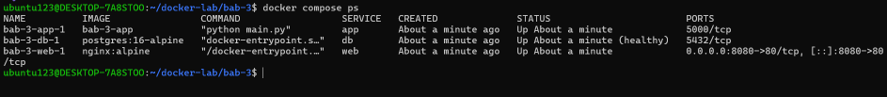 | `PASS` |
| `curl -v http://localhost:8080` (API health) | 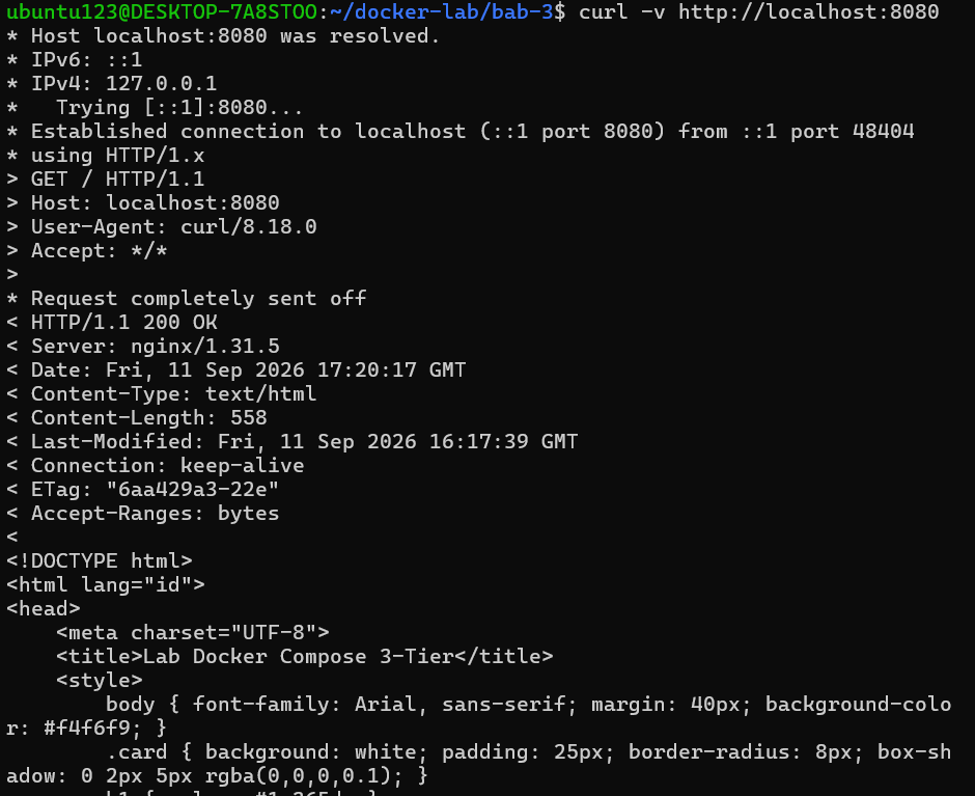 | `PASS` |
| `docker compose logs --tail 100` | 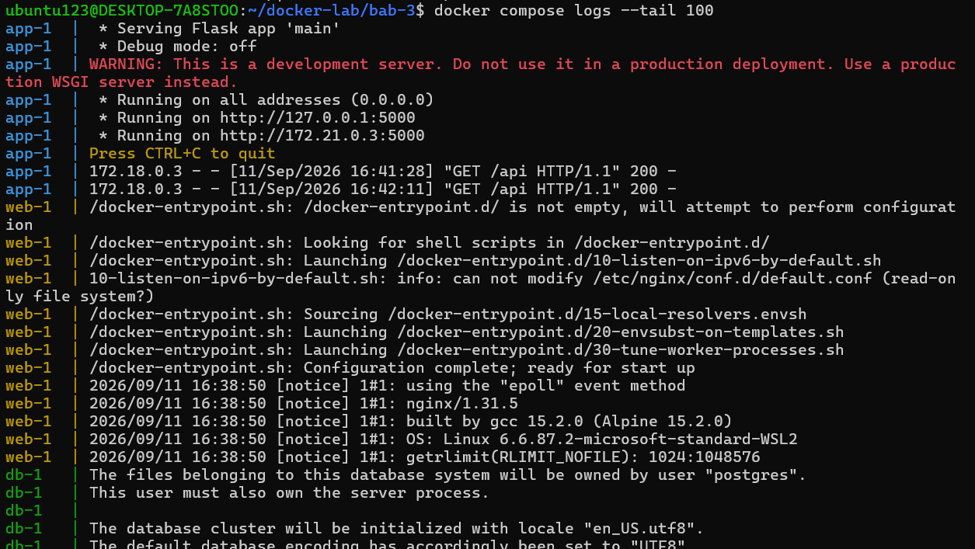 | `PASS` |

## 5. Verifikasi

| Skenario Pengujian | Hasil |
| --- | --- |
| Container di user-defined bridge dapat saling resolve menggunakan nama | `PASS` |
| Data di named volume tetap ada setelah container dihapus | `PASS` |
| Bind mount menunjukkan perubahan file host tanpa rebuild image | `PASS` |
| tmpfs kehilangan data setelah container restart | `PASS` |
| Compose stack web-app-db berjalan dan API health menampilkan koneksi database | `PASS` |

## 6. Analisis Wajib
### 6.1 Jelaskan satu masalah yang muncul dan cara Anda mendiagnosisnya.
- `Masalah:` Build image aplikasi Flask (app) gagal pada langkah apk add dengan error TLS: unspecified error.
- `Diagnosis:` Log menunjukkan kegagalan unduh paket Alpine akibat gangguan SSL/TLS CDN. Aplikasi menggunakan psycopg2-binary (pre-compiled wheel), sehingga tidak memerlukan build tools C (gcc, musl-dev).
- `Solusi:` Mengubah base image ./app/Dockerfile ke python:3.11-slim (Debian). Solusi ini menghilangkan dependensi apk dan membuat proses build sukses serta lebih cepat.

### 6.2 Jelaskan risiko keamanan atau operasional yang relevan pada bab ini
- `Hardcoded Credentials:` Password database ditulis plain text di docker-compose.yml, berisiko bocor ke version control.
- `Privilege Root:` Aplikasi berjalan sebagai root di dalam container, meningkatkan risiko keamanan jika terkena celah Remote Code Execution (RCE).
- `Tanpa Limit Resources:` Container belum diberi batasan CPU/RAM, berpotensi memicu Out-Of-Memory (OOM) atau Denial of Service (DoS).

### 6.3 Berikan rekomendasi perbaikan bila lab ini akan dibawa ke production-like environment.
- Gunakan Docker Secrets: Pindahkan password database dari Compose ke Docker Secrets atau Secret Manager.
- Jalankan Non-Root User: Tambahkan USER non-root pada Dockerfile dan batasi capabilities kernel.
- Terapkan Resource Limits: Tambahkan batasan CPU dan RAM pada tiap service di Compose (misal: memory: 512M).
- Aktifkan HTTPS/TLS: Gunakan SSL/TLS pada Nginx proxy untuk enkripsi lalu lintas data.

## 9. Kesimpulan

Praktikum Bab 3 berhasil mengimplementasikan arsitektur 3-tier terisolasi secara deklaratif menggunakan Docker Compose untuk mengordinasikan layanan Nginx, Python Flask, dan PostgreSQL. Melalui penggunaan user-defined bridge network (frontend dan backend), named volume (pg-data), serta konfigurasi healthcheck, sistem mampu menjaga keamanan isolasi database, menjamin persistensi data, dan memastikan dependensi antar-service berjalan secara stabil.
