# Bab 4 — Web Service Container: Apache, Nginx, Reverse Proxy, dan TLS

| | |
| --- | --- |
| **Nama** | `Arsyita Devanaya Arianto` |
| **NIM** | `3126640046` |
| **Kelas** | `D4 RPL IT B` |

---

## Daftar Isi

- [1. Tujuan dan Ruang Lingkup](#1-tujuan-dan-ruang-lingkup)
- [2. Landasan Teori](#2-landasan-teori)
    - [2.1 Perbandingan Apache dan Nginx](#21-perbandingan-apache-dan-nginx)
    - [2.2 Peta Konsep: Cara Kerja Apache httpd](#22-peta-konsep-cara-kerja-apache-httpd)
    - [2.3 Peta Konsep: Cara Kerja Nginx](#23-peta-konsep-cara-kerja-nginx)
    - [2.4 HTTP Routing, Reverse Proxy, Header Forwarding](#24-http-routing-reverse-proxy-header-forwarding)
    - [2.5 TLS: End-to-End versus Offloading, dan Siklus Hidup Sertifikat](#25-tls-end-to-end-versus-offloading-dan-siklus-hidup-sertifikat)
    - [2.6 Availability, Health Check, dan Failure Mode](#26-availability-health-check-dan-failure-mode)
    - [2.7 Logging dan Waktu Standar (UTC)](#27-logging-dan-waktu-standar-utc)
    - [2.8 Konfigurasi sebagai Kode dan Tata Kelola Perubahan](#28-konfigurasi-sebagai-kode-dan-tata-kelola-perubahan)
- [3. Metodologi](#3-metodologi)
- [4. Pelaksanaan Praktikum](#4-pelaksanaan-praktikum)
    - [4.1 Direktori Kerja](#41-direktori-kerja)
    - [4.2 Sertifikat TLS Laboratorium](#42-sertifikat-tls-laboratorium)
    - [4.3 File `compose.yaml`](#43-file-composeyaml)
    - [4.4 File `nginx/conf/default.conf`](#44-file-nginxconfdefaultconf)
    - [4.5 File `apache/sites/index.html`](#45-file-apachesitesindexhtml)
    - [4.6 File `app/requirements.txt`](#46-file-apprequirementstxt)
    - [4.7 File `app/app.py`](#47-file-appapppy)
    - [4.8 File `app/Dockerfile`](#48-file-appdockerfile)
    - [4.9 Validasi Model Compose](#49-validasi-model-compose)
    - [4.10 Build dan Menjalankan Stack](#410-build-dan-menjalankan-stack)
    - [4.11 Pengujian Cepat](#411-pengujian-cepat)
    - [4.12 Pemeriksaan Isolasi](#412-pemeriksaan-isolasi)
    - [4.13 Log](#413-log)
    - [4.14 Checklist PASS](#414-checklist-pass)
    - [4.15 Cleanup](#415-cleanup)
    - [4.16 Struktur File Akhir](#416-struktur-file-akhir)
    - [4.17 Ringkasan Hasil Eksekusi](#417-ringkasan-hasil-eksekusi)
- [5. Verifikasi](#5-verifikasi)
- [6. Analisis Hasil](#6-analisis-hasil)
    - [6.1 Masalah yang Muncul dan Cara Mendiagnosisnya](#61-masalah-yang-muncul-dan-cara-mendiagnosisnya)
    - [6.2 Risiko Keamanan dan Operasional pada Bab Ini](#62-risiko-keamanan-dan-operasional-pada-bab-ini)
    - [6.3 Rekomendasi untuk Environment Production-like](#63-rekomendasi-untuk-environment-production-like)
- [7. Refleksi Keamanan dan Operasional](#7-refleksi-keamanan-dan-operasional)
- [8. Troubleshooting](#8-troubleshooting)
- [9. Kesimpulan](#9-kesimpulan)
- [8. Refleksi Keamanan dan Operasional](#8-refleksi-keamanan-dan-operasional)
- [9. Kesimpulan](#10-kesimpulan)

## 1. Tujuan dan Ruang Lingkup

Praktikum Bab 4 bertujuan untuk:

1. Menjalankan Apache httpd dan Nginx sebagai web server container dengan konfigurasi custom.
2. Membuat virtual host berbasis nama untuk beberapa site lab.
3. Menggunakan Nginx sebagai reverse proxy ke backend service.
4. Menerapkan sertifikat TLS self-signed untuk simulasi HTTPS.
5. Membaca access log dan error log web service dari bind mount.
6. Menyusun peta konsep routing, pencegahan header injection, dan pengendalian error pada proxy.

Ruang lingkup bab ini mencakup pembuatan struktur project `~/docker-lab/bab-4`, pembuatan sertifikat self-signed dengan OpenSSL, konfigurasi Nginx sebagai reverse proxy dengan TLS termination dan redirect HTTP ke HTTPS, stack Compose Nginx–Apache–Flask beserta healthcheck, verifikasi alur request client–proxy–backend, serta audit batas Published Port agar hanya proxy yang terekspos ke host.

## 2. Landasan Teori

### 2.1 Perbandingan Apache dan Nginx

Bab ini membandingkan dua web server yang paling banyak digunakan secara praktis, yaitu Apache HTTP Server (`httpd`) dan Nginx. Keduanya menjadi baseline image resmi yang kemudian dikustomisasi melalui file konfigurasi, bind mount, atau image turunan.

| Aspek | Apache httpd | Nginx |
| --- | --- | --- |
| Arsitektur | Process/thread per request | Event-driven asynchronous |
| Direktori config | /usr/local/apache2/conf | /etc/nginx |
| Document root | /usr/local/apache2/htdocs | /usr/share/nginx/html |
| Reverse proxy | mod_proxy (harus di-*enable*) | proxy_pass (built-in) |
| Penggunaan memory | Cenderung lebih tinggi (overhead per process/thread) | Lebih hemat, *low-level resource efficiency* |
| Use case lab | Virtual host dan kompatibilitas .htaccess | Reverse proxy, static file, TLS termination |

**Process, thread, dan event-driven.** *Process* adalah program yang sedang dieksekusi di memori oleh CPU dan memiliki identitas sendiri (PID). *Thread* adalah unit eksekusi terkecil di dalam suatu proses yang berbagi ruang memori dengan proses induknya. Analogi yang sering dipakai adalah jam analog: aplikasi jam adalah satu *process*, sedangkan jarum detik, jarum menit, dan jarum jam masing-masing bekerja sebagai *thread* terpisah di dalam satu proses tersebut.

Perbedaan penanganan request mengikuti model tersebut. Apache menggunakan *process/thread per request*: setiap request yang masuk ditangani oleh process/thread dalam *pool*, sehingga klien harus menunggu antrean atau ketersediaan thread. Nginx menggunakan model *event-driven asynchronous*: setiap request dianggap sebagai sebuah event baru, dan worker memproses event secara non-blocking. Apabila satu request sedang menunggu (misalnya koneksi ke database), worker yang sama tetap dapat melayani request lain. Konsekuensinya, jumlah thread dan kebutuhan memory pada Nginx tidak naik proporsional terhadap jumlah koneksi aktif.

### 2.2 Peta Konsep: Cara Kerja Apache httpd

Apache httpd bekerja dengan model *process/thread per request*. Parent process hanya bertugas menerima koneksi, membaca konfigurasi, dan mengelola *pool*; setiap request yang masuk dialokasikan ke satu unit kerja (process atau thread) dan unit tersebut fokus sampai request selesai. Peta konsep berikut memetakan hubungan antara proses, thread, pool, sifat blocking, pilihan MPM, serta peran Apache di dalam lab.


### 2.3 Peta Konsep: Cara Kerja Nginx


Nginx bekerja dengan model *event-driven asynchronous*. Master process hanya bertugas membaca konfigurasi, membuka socket listener, lalu membuat dan memantau worker. Semua request dikerjakan oleh worker dengan jumlah tetap, dan jumlah worker tidak bergantung pada jumlah koneksi aktif.

Di dalam setiap worker hanya ada satu event loop. Koneksi tidak diperlakukan sebagai process atau thread baru, melainkan dicatat sebagai event di dalam antrean event. Worker memproses antrean itu secara non-blocking: ketika satu event harus menunggu I/O, worker langsung mengembalikan kendali ke event loop untuk mengerjakan koneksi lain yang lebih dulu selesai. Setelah datanya siap, worker melanjutkan event yang tadi tertunda. Dengan begitu setiap koneksi masuk ditangani secara asynchronous sampai seluruh prosesnya selesai.

Event yang datang selalu diterima dan diproses sebanyak mungkin dalam satu putaran. Apabila tidak ada lagi event yang perlu diproses dan koneksi sudah selesai, koneksi ditutup dan worker masuk ke kondisi menunggu, bukan menyisakan satu unit eksekusi khusus untuk tiap koneksi. Inilah alasan Nginx lebih hemat memory dibanding Apache pada tingkat konkurensi yang sama.


### 2.4 HTTP Routing, Reverse Proxy, Header Forwarding


HTTP memakai pola request–response, dan reverse proxy menjaga konteks request dengan menetapkan header seperti `X-Forwarded-For`, `X-Forwarded-Proto`, `X-Forwarded-Port`, dan `Host`. Header ini hanya dapat dipercaya bila request benar-benar melewati proxy; jika backend dapat diakses langsung, penyerang dapat mengirim *fake header* yang memengaruhi log, URL absolut, dan keputusan keamanan. Karena itu, *trust boundary* dijaga melalui topologi network (backend tanpa *published port*) dan pembatasan proxy terpercaya.

Routing harus dikonfigurasi ketat, karena aturan path yang longgar dapat membuka endpoint administratif, file internal, atau route debugging. Karena itu request lebih dahulu melewati **normalisasi URI** sebelum diteruskan. Kegagalan juga dikendalikan dengan menetapkan kode HTTP yang jelas agar sistem gagal secara terkendali:

| Kode | Arti | Pemicu pada lab |
| --- | --- | --- |
| `301` | Moved Permanently | HTTP port 8080 dialihkan ke HTTPS 8443 |
| `404` | Not Found | Path/URI tidak terdaftar di upstream |
| `405` | Method Not Allowed | Method HTTP tidak didukung endpoint |
| `413` | Payload Too Large | Body/file melebihi batas ukuran |
| `500` | Internal Server Error | Kesalahan pada aplikasi backend |
| `502` | Bad Gateway | Upstream tidak dapat dihubungi proxy |
| `503` | Service Unavailable | Backend belum siap menerima trafik |

### 2.5 TLS: End-to-End versus Offloading, dan Siklus Hidup Sertifikat

Transport Layer Security melindungi kerahasiaan dan integritas data selama transit serta membantu client memverifikasi identitas server. Ada dua opsi jalur TLS pada arsitektur reverse proxy:

| Opsi | Penjelasan | Trade-off |
| --- | --- | --- |
| **TLS End-to-End** | Enkripsi dipasang dari proxy sampai tingkat backend/web app | Backend harus punya trust store; CPU lebih tinggi di tiap hop |
| **TLS Offloading** | Enkripsi dihentikan (*terminated*) hanya di level proxy; komunikasi proxy–backend memakai HTTP biasa | Proxy menjadi titik confianza tunggal; tidak terenkripsi |

Praktikum Bab 4 memakai **TLS Offloading** di proxy: Nginx menangani TLS, lalu meneruskan request ke `apache-web:80` dan `flask-app:5000` melalui HTTP di dalam network Compose.

Sertifikat self-signed hanya cocok untuk laboratorium. Pada produksi, sertifikat harus berasal dari *certificate authority* yang dipercaya, memiliki nama host yang tepat, dan diperbarui sebelum kedaluwarsa dengan otomatisasi renewal (misalnya ACME/Let's Encrypt) di reverse proxy. **Private key bersifat rahasia dan tidak boleh di-*hardcode* maupun dimasukkan ke dalam Docker Image atau Repository.** Praktik terbaik adalah private key dipasang pada saat runtime sebagai *Secret* atau file *read-only* dengan izin akses/permission paling minimal, dan rotasi perlu diuji tanpa membangun ulang seluruh aplikasi.

Kualitas konfigurasi TLS tidak cukup diukur dari keberhasilan koneksi. Protokol dan cipher usang, redirect yang salah, atau *mixed content* tetap menurunkan perlindungan. Evidence yang memadai mencakup identitas sertifikat, masa berlaku, hasil *handshake*, redirect HTTP-ke-HTTPS, dan kegagalan koneksi ketika hostname tidak cocok.

### 2.6 Availability, Health Check, dan Failure Mode

Reverse proxy harus membedakan kegagalan koneksi, timeout, dan respons aplikasi yang sah. Timeout yang terlalu panjang menahan worker serta memperbesar risiko *resource exhaustion*, sedangkan timeout yang terlalu pendek menolak request yang sebenarnya valid.

Pemeriksaan kondisi container/layanan dibedakan menjadi dua jenis:

| Jenis | Pertanyaan | Aturan Tindakan |
| --- | --- | --- |
| **Liveness check** | Apakah proses di dalam container masih hidup/berjalan? | *Pass* → container dipertahankan (*keep alive*). *Fail* → sistem melakukan restart container. |
| **Readiness check** | Apakah layanan siap menerima trafik, termasuk terhubung ke Database, Cache, atau API eksternal? | *Pass* → trafik diteruskan (*pass route*). *Fail* → proxy/upstream memblokir trafik dan mengembalikan `503 Service Unavailable`. |

Healthcheck `flask-app` pada `compose.yaml` menguji endpoint `/health` menggunakan `urllib.request`, dan `proxy` memakai `depends_on` dengan `condition: service_healthy` agar trafik tidak diteruskan sebelum backend benar-benar siap. Status container `running` saja tidak membuktikan aplikasi siap menerima request.

### 2.7 Logging dan Waktu Standar (UTC)

Komponen log penting di proxy meliputi *timestamp* (waktu kejadian), *client IP*, *method*, *path*, *status code*, dan *response time*. Log juga berguna untuk keperluan *forensic*, sehingga field minimum umumnya meliputi waktu, method, path yang sudah disanitasi, status, durasi, ukuran respons, identitas request, dan upstream.

Log **disarankan selalu menggunakan format waktu UTC (Coordinated Universal Time)**. Alasannya, UTC bersifat universal sehingga memudahkan analisis bukti digital antarlokasi server/wilayah — misalnya server di Papua berselisih dua jam dengan WIB — tanpa perlu mengubah pencatatan waktu asli. Pencatatan log tidak boleh merekam secret, token, atau data pribadi secara berlebihan; log merupakan evidence yang harus memiliki *timestamp* konsisten dan retensi yang sesuai.

### 2.8 Konfigurasi sebagai Kode dan Tata Kelola Perubahan

Konfigurasi reverse proxy diperlakukan sebagai kode: setiap perubahan pada virtual host, route, header, sertifikat, dan timeout melalui *review*, uji sintaks (`nginx -t`), *test* integrasi, dan pencatatan versi. *Rollback* memperhitungkan kompatibilitas aplikasi, cache, sertifikat, dan koneksi aktif. Perubahan pada web layer menghubungkan tim aplikasi, platform, dan keamanan melalui matriks tanggung jawab, dan uji penerimaan dijalankan ulang setelah perubahan dependency atau base image.

## 3. Metodologi

Laboratorium menggunakan satu host yang menjalankan Docker Engine dan Docker Compose v2 dengan direktori kerja `~/docker-lab/bab-4` yang berisi subdirektori `apache/sites`, `nginx/conf`, `certs`, `logs/nginx`, dan `app`. Sertifikat self-signed RSA 2048 bit dengan SAN `localhost` dan `127.0.0.1` dihasilkan memakai OpenSSL, kemudian permission private key dikunci ke `600`. Konfigurasi Nginx, Compose, dan aplikasi ditulis sebagai file di host dan di-*bind mount* ke container, lalu seluruh service dijalankan melalui Compose pada network `web-net` dengan mode bridge.

Verifikasi dilakukan berurutan mulai dari validasi model Compose (`docker compose config`), pemeriksaan status container, pengujian HTTP/HTTPS dengan `curl`, pemeriksaan `openssl s_client` untuk parameter TLS, audit isolasi network, sampai pembacaan access log pada bind mount. Setiap sub-langkah diuji dengan request positif dan negatif sebelum melanjutkan ke langkah berikutnya. Perintah cleanup (`docker compose down`) dijalankan pada akhir sesi agar port 8080 dan 8443 dapat digunakan kembali. Private key tidak dicetak penuh pada laporan.

## 4. Pelaksanaan Praktikum

### 4.1 Direktori Kerja

Membuat struktur direktori kerja proyek `~/docker-lab/bab-4` beserta subdirektorinya, lalu pindah ke direktori tersebut sebagai lokasi utama praktikum.

```bash
mkdir -p ~/docker-lab/bab-4/{apache/sites,nginx/conf,certs,logs/nginx,app}
cd ~/docker-lab/bab-4
```

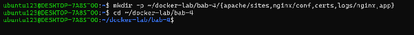

Struktur direktori awal dapat dipastikan dengan `tree`, sebelum file konfigurasi ditulis.

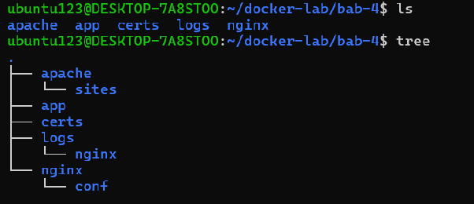

Struktur file yang disusun pada bab ini adalah sebagai berikut.

```text
bab-4/
├── compose.yaml
├── nginx/conf/default.conf
├── apache/sites/index.html
├── app/Dockerfile
├── app/requirements.txt
├── app/app.py
├── certs/lab.crt
├── certs/lab.key
└── logs/nginx/
```

### 4.2 Sertifikat TLS Laboratorium

Membuat sertifikat X.509 self-signed RSA 2048 bit berlaku 365 hari untuk `CN=localhost` dengan `subjectAltName` agar dapat diakses melalui `localhost` maupun `127.0.0.1`. Private key langsung dikunci dengan permission `600` agar tidak dapat dibaca service lain, sedangkan sertifikat publik diberi permission `644`.

```bash
openssl req -x509 -nodes -days 365 -newkey rsa:2048 \
  -keyout certs/lab.key \
  -out certs/lab.crt \
  -subj "/CN=localhost/O=DevSecOps Docker Lab" \
  -addext "subjectAltName=DNS:localhost,IP:127.0.0.1"

chmod 600 certs/lab.key
chmod 644 certs/lab.crt
```

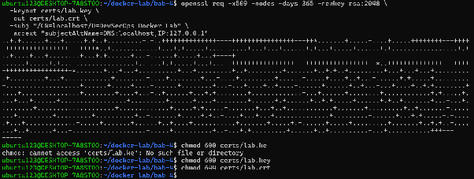

Pada eksekusi pertama, `chmod 600 certs/lab.key` gagal dengan pesan `cannot access 'certs/lab.key': No such file or directory`. Penyebabnya adalah perintah yang dijalankan salah `certs/lab.ke` tidak ditemukan. Setelah `certs/lab.key`, kedua perintah `chmod` berhasil dijalankan.

> Catatan: `lab.key` merupakan private key. File ini tidak boleh dikomit ke repository dan hanya dipasang saat runtime sebagai mount read-only.

### 4.3 File `compose.yaml`

Menulis `compose.yaml` sebagai definisi deklaratif stack berisi 3 service (`proxy` = Nginx, `apache-web` = Apache httpd, `flask-app` = Flask) dan 1 network bridge `web-net`. Hanya `proxy` yang memiliki published port, dan kedua port dibatasi ke loopback `127.0.0.1` sehingga tidak mengikat seluruh interface host.

```bash
nano compose.yaml
```

```yaml
services:
  proxy:
    image: nginx:alpine
    ports:
      - "127.0.0.1:8080:80"
      - "127.0.0.1:8443:443"
    volumes:
      - ./nginx/conf:/etc/nginx/conf.d:ro
      - ./certs:/etc/nginx/certs:ro
      - ./logs/nginx:/var/log/nginx
    networks:
      - web-net
    depends_on:
      apache-web:
        condition: service_started
      flask-app:
        condition: service_healthy

  apache-web:
    image: httpd:2.4-alpine
    volumes:
      - ./apache/sites:/usr/local/apache2/htdocs:ro
    networks:
      - web-net

  flask-app:
    build:
      context: ./app
    networks:
      - web-net
    healthcheck:
      test:
        - CMD
        - python
        - -c
        - "import urllib.request; urllib.request.urlopen('http://127.0.0.1:5000/health')"
      interval: 5s
      timeout: 3s
      retries: 5
      start_period: 5s

networks:
  web-net:
    driver: bridge
```

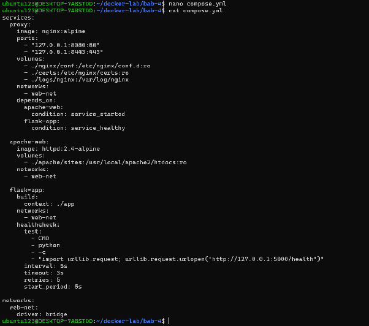

`./certs` dan `./nginx/conf` dipasang read-only (`:ro`) karena container hanya membutuhkan akses baca; `./logs/nginx` dipasang *writable* karena Nginx harus menulis access log dan error log ke direktori host. Image `nginx:alpine` sudah membawa modul `stream` sehingga `proxy_pass` tersedia tanpa konfigurasi tambahan.

### 4.4 File `nginx/conf/default.conf`

Nginx dikonfigurasi sebagai reverse proxy untuk dua upstream, yaitu `apache_backend` (`apache-web:80`) dan `flask_backend` (`flask-app:5000`). Port 80 hanya berfungsi sebagai pintu masuk yang mengembalikan `301` ke HTTPS, sedangkan port 443 menjalankan TLS termination dengan protokol minimum TLS 1.2.

```bash
nano nginx/conf/default.conf
```

```nginx
upstream apache_backend {
    server apache-web:80;
}

upstream flask_backend {
    server flask-app:5000;
}

server {
    listen 80;
    server_name localhost;
    return 301 https://$host:8443$request_uri;
}

server {
    listen 443 ssl;
    server_name localhost;

    ssl_certificate     /etc/nginx/certs/lab.crt;
    ssl_certificate_key /etc/nginx/certs/lab.key;
    ssl_protocols TLSv1.2 TLSv1.3;

    add_header X-Content-Type-Options "nosniff" always;
    add_header X-Frame-Options "DENY" always;
    add_header Referrer-Policy "no-referrer" always;

    location / {
        proxy_pass http://apache_backend;
        proxy_set_header Host $host;
        proxy_set_header X-Real-IP $remote_addr;
        proxy_set_header X-Forwarded-For $proxy_add_x_forwarded_for;
        proxy_set_header X-Forwarded-Proto $scheme;
    }

    location /api/ {
        proxy_pass http://flask_backend/;
        proxy_set_header Host $host;
        proxy_set_header X-Real-IP $remote_addr;
        proxy_set_header X-Forwarded-For $proxy_add_x_forwarded_for;
        proxy_set_header X-Forwarded-Proto $scheme;
    }
}
```

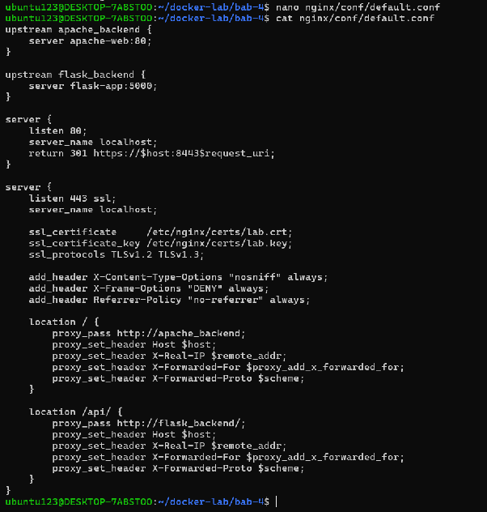

Beberapa keputusan konfigurasi yang perlu dicatat:

1. **Virtual host berbasis nama.** Blok `server` dipisahkan berdasarkan `server_name`, sehingga penambahan site lab berikutnya cukup dengan blok `server` baru tanpa mengubah konfigurasi service lain.
2. **Header tepercaya diteruskan.** `Host`, `X-Real-IP`, `X-Forwarded-For`, dan `X-Forwarded-Proto` diisi proxy agar backend mengetahui identitas client asli dan skema koneksi yang sebenarnya. Karena `apache-web` dan `flask-app` tidak memiliki published port, satu-satunya jalan masuk ke kedua service tersebut adalah melalui proxy.
3. **Normalisasi trailing slash.** `location /api/` dipasangkan dengan `proxy_pass http://flask_backend/` (memakai trailing slash) sehingga prefix `/api` dihapus sebelum request diteruskan ke Flask.
4. **Header keamanan respons.** `X-Content-Type-Options`, `X-Frame-Options`, dan `Referrer-Policy` dipasang dengan flag `always` agar tetap terkirim pada respons error seperti 4xx/5xx.

### 4.5 File `apache/sites/index.html`

Apache httpd berfungsi sebagai origin server yang menyajikan halaman statis dari document root `/usr/local/apache2/htdocs`, yang di-*bind mount* read-only dari `./apache/sites`. Halaman ini menjadi bukti bahwa request benar-benar melewati proxy menuju Apache, bukan dilayani langsung oleh Nginx.

```bash
nano apache/sites/index.html
```

```html
<!DOCTYPE html>
<html lang="id">
<head>
    <meta charset="UTF-8">
    <title>DevSecOps Bab 4</title>
</head>
<body>
    <h1>Apache di Belakang Nginx</h1>
    <p>Halaman Bab 4 berhasil dilayani melalui reverse proxy.</p>
    <p><a href="/api/">Uji Flask API</a></p>
</body>
</html>
```

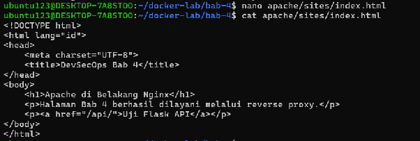

### 4.6 File `app/requirements.txt`

Mendaftarkan dependensi Python untuk aplikasi Flask beserta WSGI server `gunicorn`. Pin versi dipakai agar hasil build reproducible dan tidak berubah sesuai rilis terbaru.

```bash
nano app/requirements.txt
```

```text
Flask==3.1.2
gunicorn==23.0.0
```

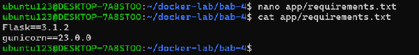

### 4.7 File `app/app.py`

Aplikasi Flask menyediakan dua endpoint JSON. Endpoint `/` mengembalikan informasi service termasuk nilai `X-Forwarded-Proto` yang diteruskan proxy — nilai ini membuktikan bahwa header tepercaya benar-benar sampai di backend — sedangkan `/health` menjadi target *readiness check* Compose.

```bash
nano app/app.py
```

```python
from flask import Flask, jsonify, request

app = Flask(__name__)


@app.get("/")
def index():
    return jsonify(
        status="ok",
        service="flask-app",
        message="API Bab 4 berhasil diakses melalui Nginx",
        forwarded_proto=request.headers.get("X-Forwarded-Proto"),
    )


@app.get("/health")
def health():
    return jsonify(status="healthy"), 200
```

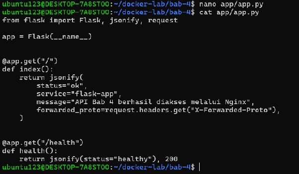

### 4.8 File `app/Dockerfile`

Image aplikasi dibangun dari `python:3.12-slim`. Container berjalan sebagai user non-root `appuser` dengan UID 10001, bukan sebagai root, sehingga probabilitas dampak celah eksekusi kode jauh lebih kecil. Build dik resiliency terhadap kegagalan jaringan dengan `pip install --no-cache-dir`.

```bash
nano app/Dockerfile
```

```dockerfile
FROM python:3.12-slim

WORKDIR /app

COPY requirements.txt .
RUN pip install --no-cache-dir -r requirements.txt

COPY app.py .

RUN useradd --system --uid 10001 --no-create-home appuser
USER appuser

EXPOSE 5000

CMD ["gunicorn", "--bind", "0.0.0.0:5000", "--workers", "2", "app:app"]
```

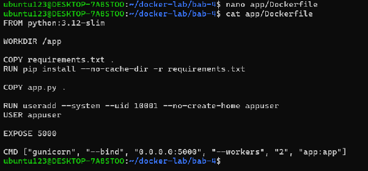

> Catatan: `EXPOSE 5000` hanya bersifat dokumentatif dan tidak memublikasikan port ke host. Pem publikasian tetap harus dinyatakan eksplisit pada `ports`.

### 4.9 Validasi Model Compose

Sebelum menjalankan apa pun, seluruh file yang ditulis diverifikasi. Langkah pertama `find` untuk memastikan tidak ada file yang terlewat atau salah nama.

```bash
cd ~/docker-lab/bab-4
find . -maxdepth 3 -type f | sort
```

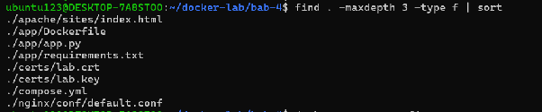

Delapan file terverifikasi ada: `compose.yaml`, `apache/sites/index.html`, `app/Dockerfile`, `app/app.py`, `app/requirements.txt`, `certs/lab.crt`, `certs/lab.key`, dan `nginx/conf/default.conf`.

`docker compose config` memvalidasi kebenaran YAML sekaligus menampilkan model komposisi akhir setelah *interpolation* dan *merge*. Keluarannya juga membuktikan bahwa hanya `proxy` yang memiliki `ports`, sedangkan `apache-web` dan `flask-app` tidak memiliki published port sama sekali.

```bash
docker compose config
```

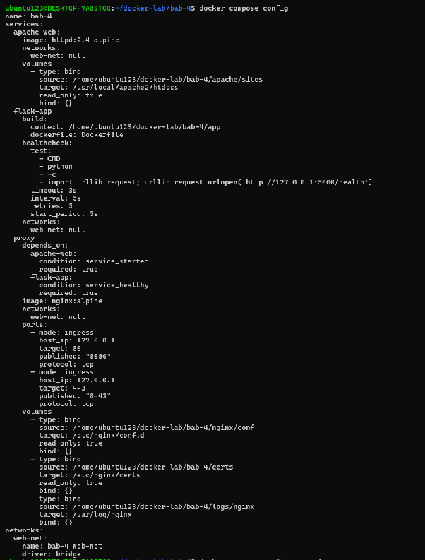

`--services` hanya mendaftarkan nama-nama service yang terdefinisi tanpa menampilkan konfigurasi lengkap.

```bash
docker compose config --services
```

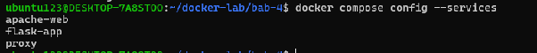

Service yang harus muncul:

```text
apache-web
flask-app
proxy
```

Urutan keluaran `docker compose config --services` bersifat alfabetis (`apache-web`, `flask-app`, `proxy`) dan tetap terdiri dari tiga service yang sama dengan cheatsheet.

### 4.10 Build dan Menjalankan Stack

Stack dijalankan dengan membangun image aplikasi sekaligus menyalakan semua container di background sesuai model Compose.

```bash
docker compose up -d --build
```

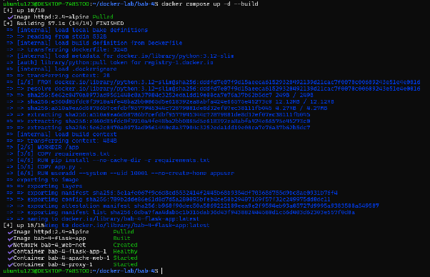

`docker compose ps` digunakan untuk mengecek status, health, dan port setiap service.

```bash
docker compose ps
```

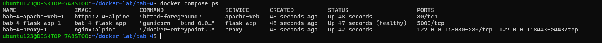

`flask-app` berstatus `healthy` setelah healthcheck berhasil, sementara `proxy` dan `apache-web` berstatus `running`. Notice `flask-app` sudah *Started* sebelum `proxy` selesai *Starting*. Hal ini menunjukkan `depends_on` dengan `condition: service_healthy` bekerja: proxy menunggu backend siap, bukan sekadar aktif.

```bash
docker compose logs --tail 100
```

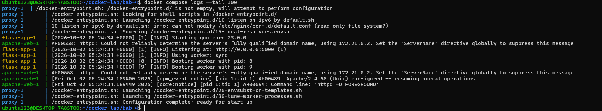

### 4.11 Pengujian Cepat

Pengujian dilakukan dengan request positif dan negatif untuk memastikan alur client–proxy–backend berjalan sesuai mestinya.

**Uji 1 — HTTP port 8080 harus dialihkan ke HTTPS.** Port 80 pada proxy tidak melayani konten; seluruh trafik diarahkan ke HTTPS.

```bash
curl -I http://localhost:8080/
```

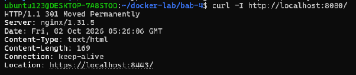

Respons `301 Moved Permanently` dengan header `Location: https://localhost:8443/` membuktikan konfigurasi redirect bekerja dan tidak ada mixed content.

```bash
curl -I http://localhost:8080/
```

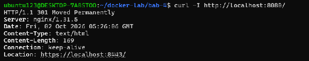

**Uji 2 — Halaman Apache melalui Nginx (port 8443).** Flag `-k` dipakai karena sertifikat bersifat self-signed.

```bash
curl -k -i https://localhost:8443/
```

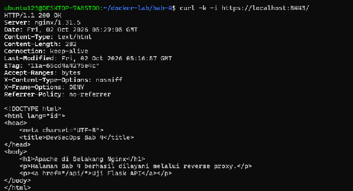

Respons `200 OK` dengan body HTML “Apache di Belakang Nginx” membuktikan request berhasil melewati proxy menuju origin server Apache. Header `X-Frame-Options: DENY`, `X-Content-Type-Options: nosniff`, dan `Referrer-Policy: no-referrer` juga terlihat pada respons.

**Uji 3 — Flask API melalui Nginx.**

```bash
curl -k https://localhost:8443/api/
```

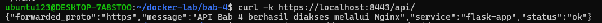

Field `forwarded_proto` bernilai `https`. Ini bukti langsung bahwa `proxy_set_header X-Forwarded-Proto $scheme` bekerja dan aplikasi backend membaca nilai yang benar — bukan tebakan dari `request.scheme`.

**Uji 4 — Health endpoint Flask.** Endpoint ini juga dipakai healthcheck Compose.

```bash
curl -k -i https://localhost:8443/api/health
```

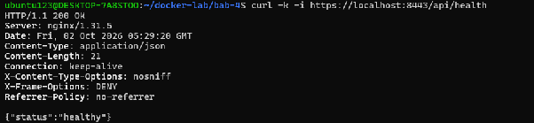

**Uji 5 — Informasi parameter TLS.** `openssl s_client` dipakai untuk memastikan protokol dan cipher yang benar-benar dinegosiasikan, bukan sekadar mengasumsikan koneksi berhasil.

```bash
openssl s_client \
  -connect localhost:8443 \
  -servername localhost \
  -brief </dev/null
```

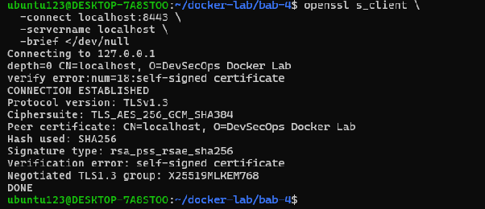

Hasil *negotiation* menunjukkan `Protocol version: TLSv1.3`, `Ciphersuite: TLS_AES_256_GCM_SHA384`, dan verification error `self-signed certificate` yang memang diharapkan di laboratorium. Field `Verification: verify certificate` memastikan nama host `localhost` sesuai dengan `CN` dan `subjectAltName` pada sertifikat.

> Catatan: `curl -k` hanya digunakan untuk mempercayai sertifikat self-signed laboratorium. Pada lingkungan production-like, sertifikat dari CA terpercaya tidak memerlukan opsi ini.

### 4.12 Pemeriksaan Isolasi

Bagian ini membuktikan bahwa hanya `proxy` yang terekspos ke host dan kedua backend hanya dapat dijangkau dari dalam `web-net`.

```bash
docker compose ps
```

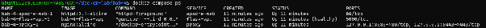

Kolom `PORTS` hanya terisi pada `proxy`; `apache-web` dan `flask-app` tidak memiliki published port. Keduanya tetap dapat menjalankan service dengan normal karena komunikasi berlangsung melalui network internal Compose.

Struktur network beserta container yang terhubung dan IP masing-masing dapat diperiksa untuk memastikan topologi segmentasi.

```bash
docker network inspect bab-4_web-net
```

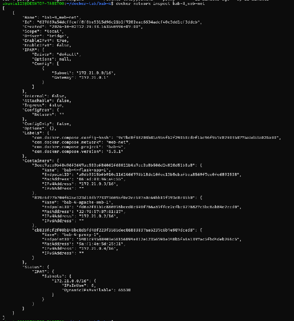

Network `bab-4_web-net` bertipe `bridge` dengan tiga container anggota: `bab-4-apache-web-1`, `bab-4-proxy-1`, dan `bab-4-flask-app-1`. Ketiganya berbagi satu segment jaringan internal.

Dari dalam container proxy, origin server Apache dapat dicapai langsung melalui DNS service tanpa melewati host.

```bash
docker compose exec proxy wget -qO- http://apache-web/
```

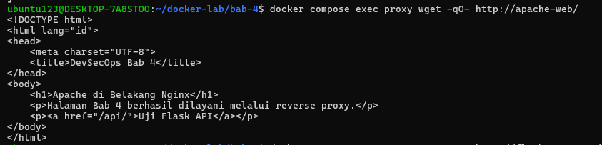

Backend Flask dan endpoint health-nya juga dapat diuji dari dalam container proxy.

```bash
docker compose exec proxy wget -qO- http://flask-app:5000/health
```

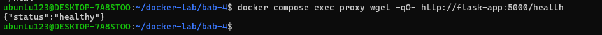

Dua pengujian tersebut membuktikan resolusi nama service bekerja pada user-defined bridge network sekaligus membuktikan isolasi jaringan: container di luar `web-net` tidak akan dapat mencapai kedua backend.

### 4.13 Log

Log proxy dibaca per service untuk memastikan tidak ada error upstream selama pengujian.

```bash
docker compose logs proxy
docker compose logs apache-web
docker compose logs flask-app
```

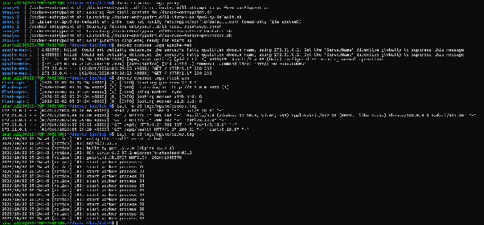

Access log dan error log dapat dibaca langsung dari bind mount di host karena `./logs/nginx` dipasang *writable* oleh Nginx, sehingga datanya tetap tersedia setelah container dihentikan.

```bash
tail -n 20 logs/nginx/access.log
tail -n 20 logs/nginx/error.log
```

Setiap baris access log memuat `timestamp` dalam UTC, `client IP`, `method`, `path`, `status code`, dan `user agent`. Error log tidak menunjukkan error upstream maupun kegagalan handshake.

### 4.14 Checklist PASS

| No | Checklist PASS | Evidence |
| --- | --- | --- |
| 1 | `docker compose config` tidak menghasilkan galat | 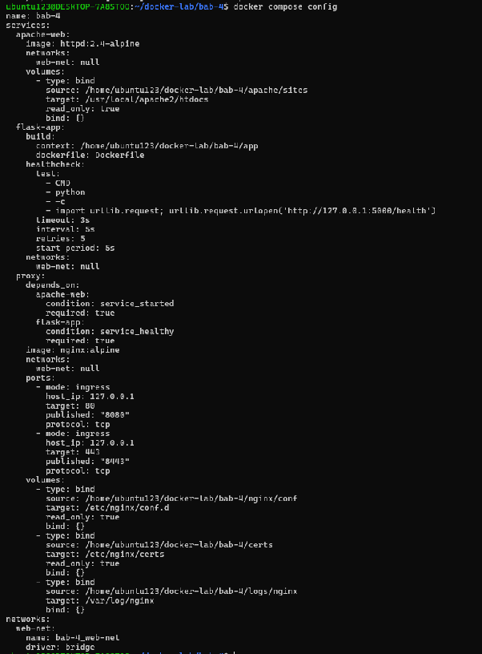 |
| 2 | `flask-app` berstatus `healthy` | 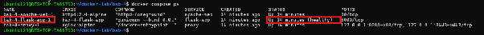 |
| 3 | HTTP port 8080 menghasilkan redirect 301 | 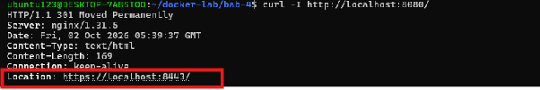 |
| 4 | HTTPS port 8443 menampilkan halaman Apache | 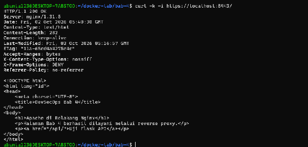 |
| 5 | `/api/` menghasilkan JSON Flask | 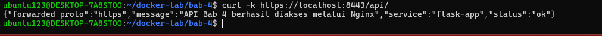 |
| 6 | TLS 1.2 atau TLS 1.3 berhasil dinegosiasikan | 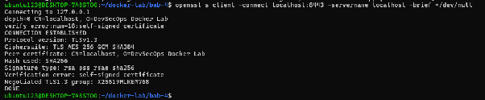 |
| 7 | Apache dan Flask tidak memiliki published port | 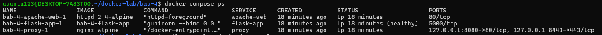 |
| 8 | Request tercatat pada access log Nginx | 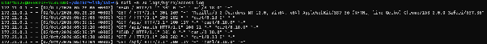 |

Seluruh butir checklist terpenuhi dengan status `PASS`.

### 4.15 Cleanup

Perintah cleanup menghentikan dan menghapus container serta network proyek. Port 8080 dan 8443 kembali bebas untuk dipakai bab berikutnya.

```bash
cd ~/docker-lab/bab-4
docker compose down
```

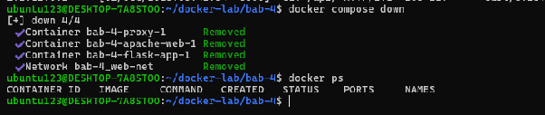

Tiga container (`apache-web`, `flask-app`, `proxy`) dan network `bab-4_web-net` terhapus. Perintah `docker ps` setelahnya tidak menampilkan container yang berjalan.

Image lokal hasil build dapat dihapus bila diperlukan:

```bash
docker compose down --rmi local
```

### 4.16 Struktur File Akhir

Susunan file proyek setelah seluruh langkah selesai sebagai dokumentasi hasil akhir.

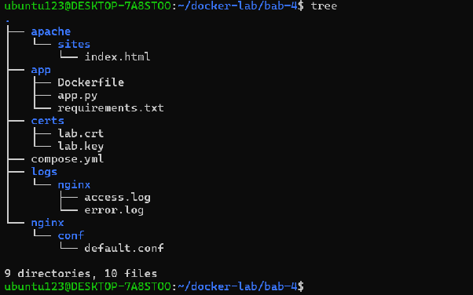

Terdapat 9 directory dan 10 file, yaitu `apache/sites/index.html`, `app/Dockerfile`, `app/app.py`, `app/requirements.txt`, `certs/lab.crt`, `certs/lab.key`, `compose.yaml`, `logs/nginx/access.log`, `logs/nginx/error.log`, dan `nginx/conf/default.conf`. Perhatikan bahwa `access.log` dan `error.log` baru muncul pada struktur akhir karena baru terbentuk setelah Nginx menerima request.

### 4.17 Ringkasan Hasil Eksekusi

| Perintah | Hasil / Catatan | Status |
| --- | --- | --- |
| `docker compose config` | Model Compose valid; hanya `proxy` yang memiliki published port | `PASS` |
| `docker compose config --services` | Menghasilkan `apache-web`, `flask-app`, `proxy` | `PASS` |
| `docker compose up -d --build` | Build image berhasil, 3 container berjalan pada `web-net` | `PASS` |
| `docker compose ps` | `flask-app` `healthy`, `proxy` dan `apache-web` `running` | `PASS` |
| `curl -I http://localhost:8080/` | `301 Moved Permanently` → `https://localhost:8443/` | `PASS` |
| `curl -k -i https://localhost:8443/` | `200 OK`, halaman “Apache di Belakang Nginx” terlayani | `PASS` |
| `curl -k https://localhost:8443/api/` | JSON Flask dengan `forwarded_proto: https` | `PASS` |
| `curl -k -i https://localhost:8443/api/health` | `200 OK` dengan `{"status":"healthy"}` | `PASS` |
| `openssl s_client -brief` | `Protocol version: TLSv1.3`, `TLS_AES_256_GCM_SHA384` | `PASS` |
| `docker network inspect bab-4_web-net` | 3 container anggota pada segment bridge internal | `PASS` |
| `docker compose exec proxy wget -qO- http://apache-web/` | HTML Apache terbaca dari dalam container proxy | `PASS` |
| `docker compose exec proxy wget -qO- http://flask-app:5000/health` | `{"status": "healthy"}` dari backend internal | `PASS` |
| `tail -n 20 logs/nginx/access.log` | Request tercatat pada bind mount host | `PASS` |
| `docker compose down` | 3 container dan 1 network terhapus | `PASS` |

## 5. Verifikasi

| Skenario Pengujian | Hasil |
| --- | --- |
| Nginx reverse proxy dapat mengakses Apache melalui nama service | `PASS` |
| Endpoint `/api` diarahkan ke backend Flask | `PASS` |
| HTTPS self-signed berjalan di port 8443 | `PASS` |
| HTTP port 8080 dialihkan otomatis ke HTTPS | `PASS` |
| Parameter TLS yang dinegosiasikan adalah TLS 1.3 dengan cipher modern | `PASS` |
| `X-Forwarded-Proto` terkirim dan dibaca dengan benar oleh backend | `PASS` |
| Access log dan error log tersimpan di direktori host | `PASS` |
| Hanya `proxy` yang memiliki published port; backend tidak terekspos | `PASS` |
| Mahasiswa mampu menjelaskan alur request client–proxy–backend | `PASS` |

## 6. Evaluasi dan Latihan Mandiri

1. Mengapa reverse proxy tidak seharusnya menjalankan semua logic aplikasi?

2. Apa perbedaan TLS termination dan end-to-end TLS?

3. Bagaimana cara mengisolasi backend agar tidak langsung diakses dari host?

4. Apa konsekuensi menyimpan private key TLS di bind mount?

5. Bandingkan log Nginx dan log Apache dari sisi format dan kegunaan debugging.

### 6.1 Jawaban

1. Reverse proxy = lapisan kebijakan, bukan lapisan bisnis. TLS termination, routing, penambahan header, pembatasan ukuran request, dan pencatatan log cukup dikelola di satu tempat sehingga mudah diaudit dan tidak tersebar per aplikasi. Aplikasi tetap memegang konteks domain seperti autentikasi, otorisasi, dan validasi input; bila logika bisnis dipaksakan ke proxy, setiap perubahan aplikasi ikut menyentuh konfigurasi infrastruktur dan saling mengikat satu sama lain. Pemisahan ini juga membuat backend dapat diskalakan tanpa mengubah perilaku proxy.

2. **TLS termination** menghentikan enkripsi di proxy: client melakukan TLS ke proxy, proxy mendekripsi lalu meneruskan HTTP biasa (atau TLS baru) ke backend. Client hanya mempercayai sertifikat yang trusting ke CA proxy, private key hanya ada di proxy, tetapi proxy menjadi titik kepercayaan tambahan dan data intra-network tidak terenkripsi. **End-to-end TLS** mempertahankan enkripsi dari client sampai backend; proxy hanya meneruskan byte dan tidak dapat membaca isi request, namun backend memerlukan trust store dan konfigurasi sertifikat sendiri, serta penggunaan CPU lebih tinggi di setiap hop.

3. Backend tidak diberi `ports` sama sekali (cukup `expose` agar dapat dijangkau service lain dalam network Compose), published port proxy dibatasi ke loopback `127.0.0.1`, dan backend ditempatkan pada network internal terpisah dari proxy. Backend juga ditambahkan allowlist sumber `X-Forwarded-*` sehingga header dari sumber yang bukan proxy diabaikan. Semua jalur trafik eksternal dipaksa melewati proxy, sehingga klaim forwarded header dapat dibuktikan lewat topologi, bukan sekadar konfigurasi aplikasi.

4. Private key pada bind mount berarti file rahasia berada di host dalam bentuk plaintext. Risiko berasal dari backup, image, cache build, atau `git add` yang tidak disengaja. Jika bocor, penyerang dapat melakukan *impersonation* dan mendelegitimasi kepercayaan server terhadap seluruh client, bukan hanya satu endpoint. Mitigasi laboratorium berupa permission `600` dan mount `read-only`; pada produksi key sebaiknya datang dari secret manager atau Docker secret dengan rotasi terjadwal.

5. Nginx memakai satu format `combined` yang memuat alamat client, request, status, ukuran body, referrer, dan user agent, serta dapat ditambah `$request_time` dan `$upstream_response_time` untuk melihat latency proxy–upstream. Apache menulis log melalui `mod_log_config` dengan format `common`/`combined` yang setara, ditambah `%D` untuk waktu handler, dan mendukung pencatatan per virtual host. Kegunaan debugging pada lab: log Nginx dipakai untuk menelusuri routing, redirect, dan penerusan header di sisi proxy, sedangkan log Apache dipakai memastikan request benar-benar sampai ke origin. Keduanya sama-sama tidak menyimpan *request body*, sehingga debugging POST tetap memerlukan *access log* aplikasi.

## 7. Analisis Hasil

### 7.1 Masalah yang Muncul dan Cara Mendiagnosisnya

| Gejala yang Muncul | Langkah Diagnosis | Akar Penyebab | Tindakan yang Diterapkan |
| --- | --- | --- | --- |
| Request ke `/api` dilayani `503 Service Unavailable` | `docker compose ps` menunjukkan `flask-app` `running`, lalu `docker compose logs flask-app` dan `curl` endpoint `/health` dari dalam container | Proses sudah hidup tetapi belum siap menerima trafik; healthcheck `/health` belum lulus sehingga `depends_on: service_healthy` menahan proxy | Menunggu healthcheck lulus,jika perlu menaikkan `start_period`/`retries`, lalu mengulang pengujian |
| `curl -k https://localhost:8443` dan `openssl s_client` menampilkan `Verification error: self-signed certificate` | Menjalankan `openssl s_client -connect localhost:8443 -servername localhost` untuk melihat verifikasi, masa berlaku, dan SAN | Sertifikat ditandatangani sendiri sehingga tidak ada rantai kepercayaan ke CA yang dipercaya | Diterima sebagai keterbatasan lab; pada produksi diganti sertifikat CA dengan renewal otomatis |
| Header `X-Forwarded-Proto` tidak dapat dipercaya jika backend dapat diakses langsung | `docker compose ps` dan `docker network inspect` untuk memastikan hanya proxy yang punya *published port* | Trust header bergantung pada topologi, bukan pada aplikasi saja | Menahan *published port* backend ke `127.0.0.1` dan memisahkan network `frontend`/`backend` |
| Port 8080 dan 8443 gagal dipakai ulang pada sesi berikutnya | `ss -lntp` untuk melihat proses yang masih memegang port | Container tidak dihentikan, atau proses lain memakai port yang sama | `docker compose down` pada akhir sesi, graceful stop, atau mengganti host port pada `compose.yaml` |

### 7.2 Risiko Keamanan dan Operasional pada Bab Ini

- **Sertifikat self-signed.** Browser dan client tidak mempercayai sertifikat laboratorium sehingga rentan terhadap *impersonation* bila dibawa ke produksi. Nilai `Verification error: self-signed certificate` pada `openssl s_client` adalah pengingat bahwa proteksi yang diperoleh baru sebatas enkripsi, belum termasuk autentikasi identitas server.
- **Private key pada bind mount.** `certs/lab.key` berada di direktori host dengan permission `600`. Bila permission tidak dibatasi atau direktori ikut dikomit, private key dapat bocor. Pada produksi, key sebaiknya dipasang sebagai *secret* dengan permission minimum dan rotasi teruji.
- **TLS offloading.** Komunikasi proxy–backend memakai HTTP biasa, sehingga pada topologi multi-host data tidak terenkripsi di jalur internal. Segmentasi network menjadi kompensasi wajib.
- **Boundary tipis.** Ketiga service berada pada satu network `web-net`. Bila proxy dibobol, penyerang memperoleh jalur langsung ke Apache dan Flask. Rekomendasi produksi adalah memisahkan network `frontend` dan `backend`.
- **Header tepercaya.** `X-Forwarded-For` dan `X-Forwarded-Proto` dapat dipalsukan bila backend dapat diakses langsung. Pada lab ini risiko tersebut diminimalkan dengan tidak adanya published port pada backend, namun perubahan konfigurasi sekecil apa pun (misalnya menambah `ports` untuk debug) akan membatalkannya.
- **Log tanpa sanitasi dan retensi.** Access log mencatat path apa adanya. Path yang berisi data sensitif (token pada query string) akan tersimpan apa adanya. Selain itu, log tanpa retensi yang jelas menyulitkan audit.
- **Sertifikat kedaluwarsa tanpa otomatisasi.** `-days 365` berarti layanan akan gagal dilayani atau memicu peringatan browser setelah satu tahun tanpa ada mekanisme pembaruan.
- **Waktu lokal vs UTC.** Bila log tidak dipaksa ke UTC, rekonstruksi insiden lintas lokasi menjadi ambigu karena selisih zona waktu.

### 7.3 Rekomendasi untuk Environment Production-like

1. **Gunakan CA terpercaya dengan renewal otomatis.** Ganti sertifikat self-signed dengan sertifikat dari CA (misalnya Let's Encrypt) dan otomatisasi renewal di reverse proxy. Simpan private key sebagai *secret* dengan permission minimum serta uji rotasi tanpa membangun ulang aplikasi.
2. **Segmentasi network.** Pisahkan network `frontend` (proxy) dan `backend` (Apache/Flask). Jangan publikasikan backend ke host dalam kondisi apa pun.
3. **Batasi binding port.** Batasi published port ke alamat manajemen atau izinkan hanya proxy ingress yang terekspos, seperti pola `127.0.0.1:8080:80` pada lab ini.
4. **Terapkan TLS modern.** Tetapkan `ssl_protocols` minimum TLS 1.2 (atau 1.3), modern cipher suite, HSTS setelah domain tervalidasi, dan redirect HTTP→HTTPS yang konsisten.
5. **Validasi forwarded header hanya dari proxy terpercaya.** Backend harus menolak `X-Forwarded-*` yang berasal dari sumber selain proxy; tambahkan allowlist IP proxy pada aplikasi.
6. **Terapkan liveness dan readiness check.** Liveness untuk memastikan proses hidup, readiness untuk memastikan layanan siap menerima trafik, dengan `depends_on: condition: service_healthy` agar proxy tidak meneruskan trafik ke backend yang belum siap.
7. **Perlakukan konfigurasi proxy sebagai kode.** Terapkan *review*, uji sintaks (`nginx -t`), *test* integrasi, pencatatan versi, dan *rollback* yang sudah teruji.
8. **Sanitasi dan rotasi log.** Hilangkan data sensitif dari log, gunakan *timestamp* UTC, dan tetapkan kebijakan retensi yang jelas.
9. **Terapkan rate limiting dan batas ukuran request.** Tambahkan `client_max_body_size` untuk mencegah `413 Payload Too Large` dan `limit_req` untuk mengurangi risiko *resource exhaustion*.

## 8. Refleksi Keamanan dan Operasional

- **Risiko keamanan:** private key pada bind mount dapat bocor; TLS self-signed tidak dipercaya client sehingga membuka kemungkinan *impersonation*; header `X-Forwarded-*` rawan *spoofing* bila backend terekspos; route longgar dapat membuka endpoint internal; semua service dalam satu network memperluas *blast radius* kompromi.
- **Risiko operasional:** sertifikat kedaluwarsa tanpa otomatisasi renewal menyebabkan outage; perubahan konfigurasi tanpa *rollback* teruji dapat mengambil seluruh layanan; log tanpa retensi dan *timestamp* konsisten melemahkan *auditability*.
- **Keterbatasan lingkungan:** konfigurasi TLS (cipher default) dapat berubah seiring versi modul atau base image, sehingga uji penerimaan perlu dijalankan ulang setelah perubahan dependency. Pada bab ini uji hanya dilakukan pada `nginx:alpine` dan `httpd:2.4-alpine` versi terkini.

## 9. Kesimpulan

Praktikum Bab 4 berhasil membangun web stack tiga lapis dengan Nginx sebagai reverse proxy dan TLS termination, Apache sebagai origin server, serta Flask sebagai backend API. Seluruh trafik dikendalikan melalui Nginx dengan routing, forwarded headers, TLS, dan healthcheck.

Eksperimen juga membuktikan pentingnya segmentasi network dan pembatasan exposure port untuk menjaga keamanan backend. Selain itu, penggunaan konfigurasi sebagai kode, pengujian, dan evidence log menjadi dasar pengelolaan web layer yang akan diterapkan pada praktikum database service berikutnya.