# Bab 5 — Database Service di Docker: PostgreSQL

| | |
| --- | --- |
| **Nama** | `Arsyita Devanaya Arianto` |
| **NIM** | `3126640046` |
| **Kelas** | `D4 RPL IT B` |

---

## Daftar Isi

- [1. Tujuan dan Ruang Lingkup](#1-tujuan-dan-ruang-lingkup)
- [2. Landasan Teori](#2-landasan-teori)
    - [2.1 Manajemen Database Container dan Persistensi Volume](#21-manajemen-database-container-dan-persistensi-volume)
    - [2.2 Peta Konsep: Manajemen Database Container dan Persistensi Volume](#22-peta-konsep-manajemen-database-container-dan-persistensi-volume)
    - [2.3 Peta Konsep: Backup dan Restore PostgreSQL dengan Docker](#23-peta-konsep-backup-dan-restore-postgresql-dengan-docker)
- [3. Metodologi](#3-metodologi)
- [4. Pelaksanaan Praktikum](#4-pelaksanaan-praktikum)
    - [4.1 Direktori Kerja](#41-direktori-kerja)
    - [4.2 File `.env.example` dan `.env`](#42-file-envexample-dan-env)
    - [4.3 File `.gitignore`](#43-file-gitignore)
    - [4.4 File `compose.yaml`](#44-file-composeyaml)
    - [4.5 File `init/01-schema.sql`](#45-file-init01-schemasql)
    - [4.6 File `pgadmin/servers.json`](#46-file-pgadminserversjson)
    - [4.7 File `scripts/backup.sh`](#47-file-scriptsbackupsh)
    - [4.8 File `scripts/restore-test.sh`](#48-file-scriptsrestore-testsh)
    - [4.9 Permission dan Validasi File](#49-permission-dan-validasi-file)
    - [4.10 Menjalankan Stack](#410-menjalankan-stack)
    - [4.11 Menguji Schema dan Data Awal](#411-menguji-schema-dan-data-awal)
    - [4.12 Menguji Persistensi Volume](#412-menguji-persistensi-volume)
    - [4.13 Backup](#413-backup)
    - [4.14 Restore Test](#414-restore-test)
    - [4.15 Monitoring Dasar](#415-monitoring-dasar)
    - [4.16 Checklist PASS](#416-checklist-pass)
    - [4.17 Cleanup](#417-cleanup)
    - [4.18 Struktur File Akhir](#418-struktur-file-akhir)
    - [4.19 Ringkasan Hasil Eksekusi](#419-ringkasan-hasil-eksekusi)
- [5. Verifikasi](#5-verifikasi)
- [6. Evaluasi dan Latihan Mandiri](#6-evaluasi-dan-latihan-mandiri)
    - [6.1 Jawaban](#61-jawaban)
- [7. Analisis Hasil](#7-analisis-hasil)
    - [7.1 Masalah yang Muncul dan Cara Mendiagnosisnya](#71-masalah-yang-muncul-dan-cara-mendiagnosisnya)
    - [7.2 Risiko Keamanan dan Operasional pada Bab Ini](#72-risiko-keamanan-dan-operasional-pada-bab-ini)
    - [7.3 Rekomendasi untuk Environment Production-like](#73-rekomendasi-untuk-environment-production-like)
- [8. Kesimpulan](#10-kesimpulan)
- [9. Catatan Penggunaan AI](#11-catatan-penggunaan-ai)

## 1. Tujuan dan Ruang Lingkup

Praktikum Bab 5 bertujuan untuk:

1. Menjalankan PostgreSQL dan pgAdmin sebagai container dengan konfigurasi berbasis environment variable dan volume persisten.
2. Menginisialisasi database menggunakan file SQL pada `docker-entrypoint-initdb.d`.
3. Mengakses database melalui `psql` dan pgAdmin4.
4. Melakukan logical backup menggunakan `pg_dump` beserta checksum, lalu menguji restore menggunakan `pg_restore` pada database terpisah.
5. Menerapkan healthcheck pada service PostgreSQL dan memverifikasi persistensi data volume.

Ruang lingkup bab ini mencakup pembuatan struktur project `~/docker-lab/bab-5` berisi Compose stack PostgreSQL–pgAdmin, init script, konfigurasi server pgAdmin (`servers.json`), script backup dan restore test, pengujian persistensi volume, verifikasi checksum dump, serta cleanup yang aman tanpa menghapus data.

## 2. Landasan Teori

### 2.1 Manajemen Database Container dan Persistensi Volume

PostgreSQL di dalam container tetap merupakan sistem database relasional penuh; container hanya mengubah cara proses dan dependensinya dikemas. Data tidak boleh dianggap melekat pada umur container. Writable layer sesuai untuk perubahan sementara, sedangkan data database memerlukan **volume persisten** yang dapat dipasang kembali ketika container diganti.

Image PostgreSQL resmi mengeksekusi file `.sql` dan `.sh` di `/docker-entrypoint-initdb.d` **hanya saat volume data masih kosong**. Mengubah init script tidak akan berpengaruh bila volume lama masih dipakai. Init script bukan pengganti migration untuk perubahan skema berikutnya.

| Variabel | Fungsi |
| --- | --- |
| `POSTGRES_DB` | Nama database awal yang dibuat ketika inisialisasi |
| `POSTGRES_USER` | User awal/superuser container |
| `POSTGRES_PASSWORD` | Password awal untuk user tersebut |
| `PGADMIN_DEFAULT_EMAIL` | Email login administratif pgAdmin |
| `PGADMIN_DEFAULT_PASSWORD` | Password login administratif pgAdmin |

Persistensi data memiliki empat dimensi: durability transaksi, keberlangsungan media, kemampuan backup, dan kemampuan **restore**. Credential tidak boleh ditanam pada image atau repository; dalam laboratorium `.env` dapat dipakai untuk demonstrasi, tetapi file tersebut harus dikecualikan dari version control dan tidak diperlakukan sebagai secret manager produksi. Port PostgreSQL dan pgAdmin pada praktikum ini dibatasi ke loopback `127.0.0.1`. Healthcheck `pg_isready` hanya membuktikan server menerima koneksi, bukan bahwa migrasi atau query bisnis benar.

### 2.2 Peta Konsep: Manajemen Database Container dan Persistensi Volume

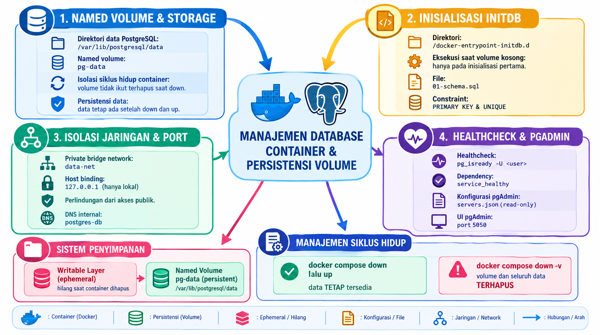

Peta konsep di atas memetakan hubungan antara container, writable layer yang bersifat sementara, dan named volume pg-data yang menyimpan data secara persisten. Init script pada /docker-entrypoint-initdb.d hanya dibaca sekali, yaitu ketika volume masih kosong, sehingga perubahan skema berikutnya harus dikelola lewat migration. Karena data hidup pada volume — bukan pada container — perintah docker compose down yang diikuti up tidak menghilangkan data, sedangkan docker compose down -v bersifat destruktif dan menghapus volume beserta seluruh isinya.

### 2.3 Peta Konsep: Backup dan Restore PostgreSQL dengan Docker

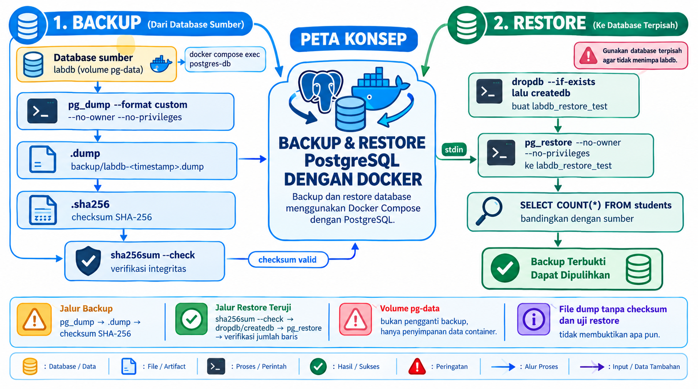

Peta konsep di atas memetakan dua jalur utama, yaitu backup (pg_dump → file .dump → checksum SHA-256) dan restore (sha256sum --check → dropdb/createdb → pg_restore → verifikasi jumlah baris). Restore sengaja diarahkan ke database terpisah labdb_restore_test agar tidak menimpa labdb. Volume pg-data bukan pengganti backup, dan file dump tanpa verifikasi checksum serta uji restore tidak membuktikan apa pun.

## 3. Metodologi

Laboratorium menggunakan satu host yang menjalankan Docker Engine dan Docker Compose v2 dengan direktori kerja ~/docker-lab/bab-5 yang berisi init, pgadmin, scripts, dan backup. Konfigurasi ditulis sebagai file di host: .env.example (template) disalin menjadi .env dengan permission 600, compose.yaml mendefinisikan postgres-db dan pgadmin pada network data-net dengan dua named volume, dan init/01-schema.sql menyiapkan tabel students beserta data awal.

Verifikasi dilakukan berurutan: validasi model Compose (docker compose config), pemeriksaan status dan health, pengujian schema/data awal lewat psql, pengujian persistensi volume dengan down–up, pembuatan backup dan verifikasi checksum, uji restore ke labdb_restore_test, monitoring dasar, lalu cleanup yang mempertahankan data. Setiap sub-langkah diuji sebelum melanjutkan ke langkah berikutnya.

## 4. Pelaksanaan Praktikum

### 4.1 Direktori Kerja

Membuat struktur direktori kerja proyek `~/docker-lab/bab-5` beserta subdirektorinya (`init`, `backup`, `pgadmin`, `scripts`), lalu pindah ke direktori tersebut.

```bash
mkdir -p ~/docker-lab/bab-5/{init,backup,pgadmin,scripts}
cd ~/docker-lab/bab-5
```

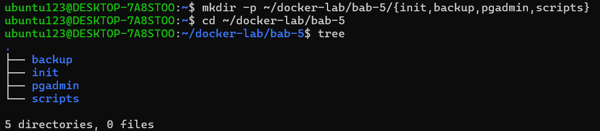

Struktur file yang disusun pada bab ini adalah sebagai berikut.

```text
bab-5/
├── .env.example
├── .env
├── .gitignore
├── compose.yaml
├── init/
│   └── 01-schema.sql
├── pgadmin/
│   └── servers.json
├── scripts/
│   ├── backup.sh
│   └── restore-test.sh
└── backup/
```

### 4.2 File `.env.example` dan `.env`

Menulis `.env.example` sebagai template konfigurasi. 

```bash
nano .env.example
```

```dotenv
POSTGRES_DB=labdb
POSTGRES_USER=labuser
POSTGRES_PASSWORD=labpass123
PGADMIN_DEFAULT_EMAIL=admin@example.com
PGADMIN_DEFAULT_PASSWORD=admin123
```
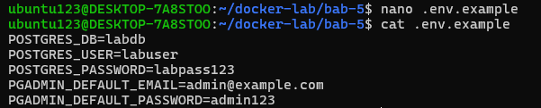

Menyalin template menjadi konfigurasi aktif, lalu mengunci permission file agar tidak terbaca service lain.

```bash
cp .env.example .env
chmod 600 .env
```

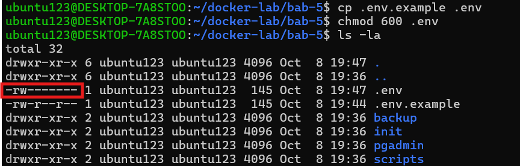

### 4.3 File `.gitignore`

Menulis `.gitignore` untuk mencegah credential dan hasil dump ikut terkirim ke Git.

```bash
nano .gitignore
```

```gitignore
.env
backup/*.dump
backup/*.sha256
backup/*.log
```

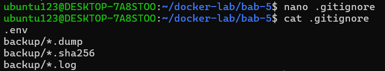

### 4.4 File `compose.yaml`

Menulis `compose.yaml` yang berisi 2 service (`postgres-db` dan `pgadmin`), 2 named volume (`pg-data`, `pgadmin-data`), 1 network bridge `data-net`, dan healthcheck `pg_isready` pada PostgreSQL. Port kedua service dibatasi ke loopback `127.0.0.1`.

```bash
nano compose.yaml
```

```yaml
services:
  postgres-db:
    image: postgres:16-alpine
    environment:
      POSTGRES_DB: ${POSTGRES_DB}
      POSTGRES_USER: ${POSTGRES_USER}
      POSTGRES_PASSWORD: ${POSTGRES_PASSWORD}
    ports:
      - "127.0.0.1:5432:5432"
    volumes:
      - pg-data:/var/lib/postgresql/data
      - ./init:/docker-entrypoint-initdb.d:ro
    networks:
      - data-net
    healthcheck:
      test:
        - CMD-SHELL
        - "pg_isready -U $${POSTGRES_USER} -d $${POSTGRES_DB}"
      interval: 5s
      timeout: 5s
      retries: 10
      start_period: 10s
    restart: unless-stopped

  pgadmin:
    image: dpage/pgadmin4:latest
    environment:
      PGADMIN_DEFAULT_EMAIL: ${PGADMIN_DEFAULT_EMAIL}
      PGADMIN_DEFAULT_PASSWORD: ${PGADMIN_DEFAULT_PASSWORD}
    ports:
      - "127.0.0.1:5050:80"
    volumes:
      - pgadmin-data:/var/lib/pgadmin
      - ./pgadmin/servers.json:/pgadmin4/servers.json:ro
    networks:
      - data-net
    depends_on:
      postgres-db:
        condition: service_healthy
    restart: unless-stopped

volumes:
  pg-data:
  pgadmin-data:

networks:
  data-net:
    driver: bridge
```

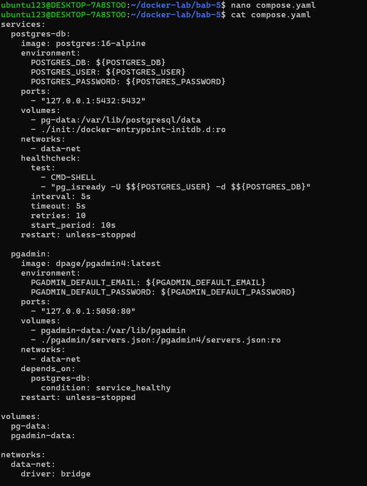

`./init` dipasang sebagai mount read-only pada `/docker-entrypoint-initdb.d` sehingga init script hanya dibaca container. pgAdmin menunggu PostgreSQL `healthy` melalui `depends_on` dengan `condition: service_healthy`. Volume `pg-data` memisahkan data dari lifecycle container.

### 4.5 File `init/01-schema.sql`

Menulis init script yang membuat tabel `students` dengan kolom `id` (`BIGSERIAL`, primary key), `nrp` (unique), `name`, dan `created_at` (timestamp UTC), lalu mengisinya dua baris data awal secara idempotent dengan `ON CONFLICT DO NOTHING`.

```bash
nano init/01-schema.sql
```

```sql
CREATE TABLE IF NOT EXISTS students (
    id BIGSERIAL PRIMARY KEY,
    nrp VARCHAR(20) UNIQUE NOT NULL,
    name TEXT NOT NULL,
    created_at TIMESTAMPTZ NOT NULL DEFAULT CURRENT_TIMESTAMP
);

INSERT INTO students (nrp, name)
VALUES
    ('31230001', 'Mahasiswa Satu'),
    ('31230002', 'Mahasiswa Dua')
ON CONFLICT (nrp) DO NOTHING;

CREATE INDEX IF NOT EXISTS idx_students_name
    ON students (name);
```

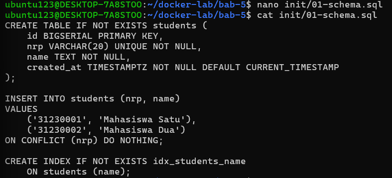

### 4.6 File `pgadmin/servers.json`

Menulis konfigurasi server agar pgAdmin langsung mendaftarkan server "PostgreSQL Bab 5" setelah login.

```bash
nano pgadmin/servers.json
```

```json
{
  "Servers": {
    "1": {
      "Name": "PostgreSQL Bab 5",
      "Group": "Laboratorium DevSecOps",
      "Host": "postgres-db",
      "Port": 5432,
      "MaintenanceDB": "labdb",
      "Username": "labuser",
      "SSLMode": "prefer"
    }
  }
}
```

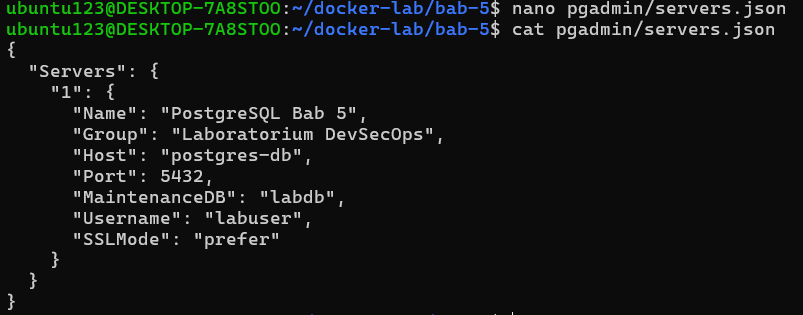

Hostname pgAdmin harus menggunakan `postgres-db`, bukan `localhost`, karena pgAdmin berjalan dalam container berbeda; di dalam container pgAdmin, `localhost` berarti container pgAdmin itu sendiri.

### 4.7 File `scripts/backup.sh`

Menulis script backup yang menggunakan `docker compose exec`, sehingga tidak bergantung pada nama container dinamis. Hasil dump (format custom) diberi timestamp UTC, lalu dibuatkan checksum SHA-256.

```bash
nano scripts/backup.sh
```

```bash
#!/usr/bin/env bash
set -Eeuo pipefail

cd "$(dirname "$0")/.."

if [[ ! -f .env ]]; then
    echo "[FAIL] File .env tidak ditemukan." >&2
    exit 1
fi

set -a
source .env
set +a

mkdir -p backup

timestamp="$(date -u +%Y%m%dT%H%M%SZ)"
dump_file="backup/${POSTGRES_DB}-${timestamp}.dump"
checksum_file="${dump_file}.sha256"

docker compose exec -T postgres-db \
    pg_dump \
    --username "$POSTGRES_USER" \
    --dbname "$POSTGRES_DB" \
    --format custom \
    --no-owner \
    --no-privileges \
    > "$dump_file"

test -s "$dump_file"
sha256sum "$dump_file" > "$checksum_file"

echo "[PASS] Backup: $dump_file"
echo "[PASS] Checksum: $checksum_file"
```

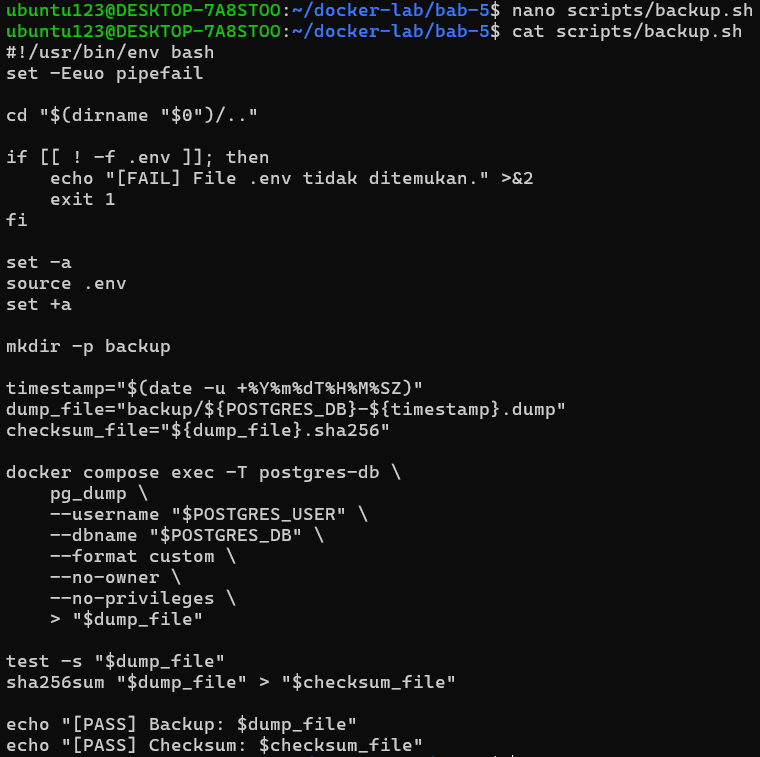

### 4.8 File `scripts/restore-test.sh`

Menulis script restore test yang **tidak menimpa** `labdb`; restore dilakukan ke database terpisah `labdb_restore_test`. Script memverifikasi checksum bila tersedia, membuat ulang database tujuan, menjalankan `pg_restore`, lalu membuktikan hasil dengan query `COUNT(*)`.

```bash
nano scripts/restore-test.sh
```

```bash
#!/usr/bin/env bash
set -Eeuo pipefail

cd "$(dirname "$0")/.."

if [[ ! -f .env ]]; then
    echo "[FAIL] File .env tidak ditemukan." >&2
    exit 1
fi

set -a
source .env
set +a

dump_file="${1:-}"
restore_database="${POSTGRES_DB}_restore_test"

if [[ -z "$dump_file" || ! -s "$dump_file" ]]; then
    echo "Penggunaan: $0 backup/nama-file.dump" >&2
    exit 1
fi

if [[ -f "${dump_file}.sha256" ]]; then
    sha256sum --check "${dump_file}.sha256"
fi

docker compose exec -T postgres-db \
    dropdb --username "$POSTGRES_USER" --if-exists "$restore_database"

docker compose exec -T postgres-db \
    createdb --username "$POSTGRES_USER" "$restore_database"

docker compose exec -T postgres-db \
    pg_restore \
    --username "$POSTGRES_USER" \
    --dbname "$restore_database" \
    --no-owner \
    --no-privileges \
    < "$dump_file"

docker compose exec -T postgres-db \
    psql \
    --username "$POSTGRES_USER" \
    --dbname "$restore_database" \
    --command "SELECT COUNT(*) AS total_students FROM students;"

echo "[PASS] Restore berhasil ke database: $restore_database"
```

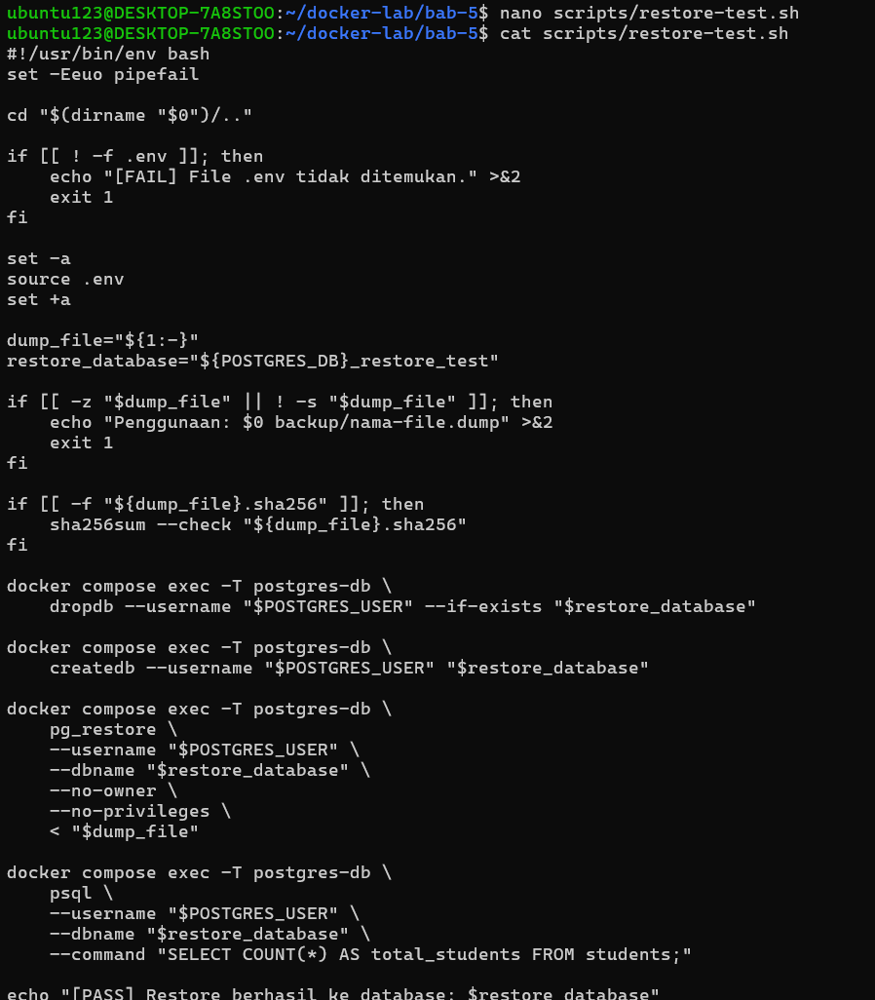

### 4.9 Permission dan Validasi File

Memberikan permission eksekusi pada kedua script, lalu memvalidasi daftar file dan model Compose sebelum menjalankan apa pun.

```bash
cd ~/docker-lab/bab-5
chmod +x scripts/backup.sh scripts/restore-test.sh

find . -maxdepth 3 -type f | sort
docker compose config
docker compose config --services
```

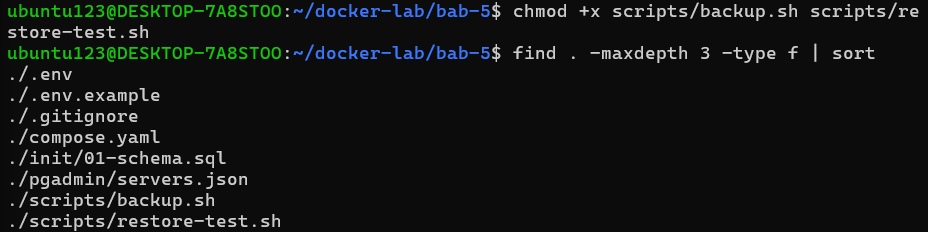

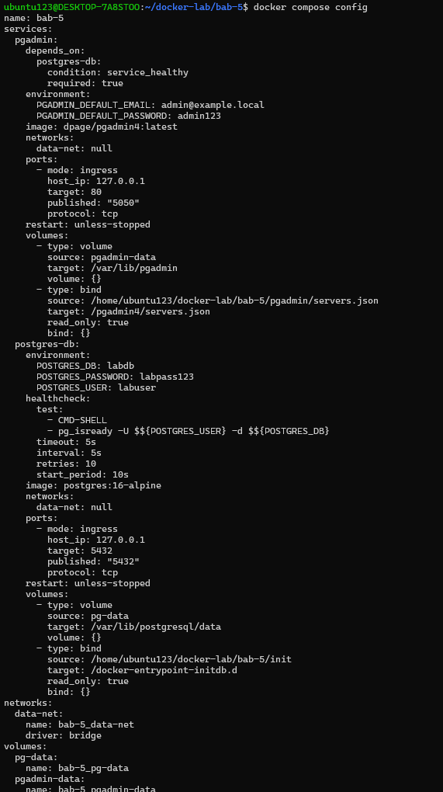

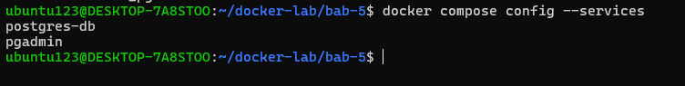


### 4.10 Menjalankan Stack

Menjalankan stack di background, memeriksa status, dan membaca log awal.

```bash
docker compose up -d
docker compose ps
docker compose logs --tail 100
```

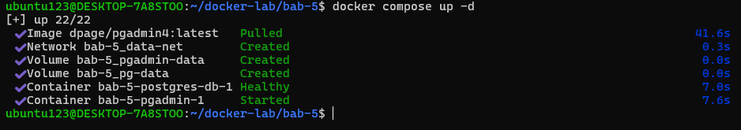

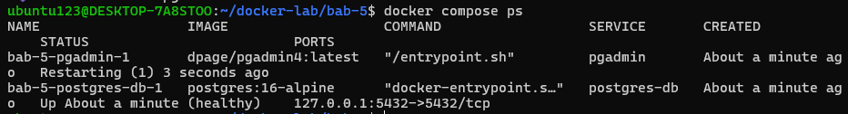

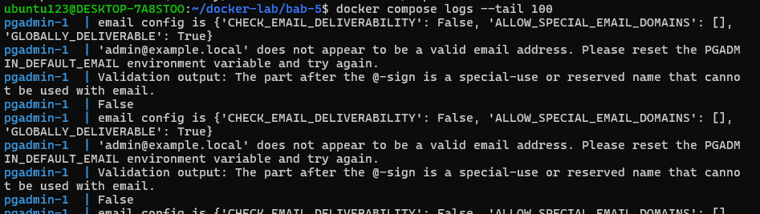

Tunggu sampai PostgreSQL berstatus `healthy`. Akses pgAdmin melalui:

```text
http://localhost:5050
```

Login menggunakan nilai `PGADMIN_DEFAULT_EMAIL` dan `PGADMIN_DEFAULT_PASSWORD` pada `.env`, lalu hubungkan server "PostgreSQL Bab 5" dengan memasukkan password PostgreSQL (`labpass123`).

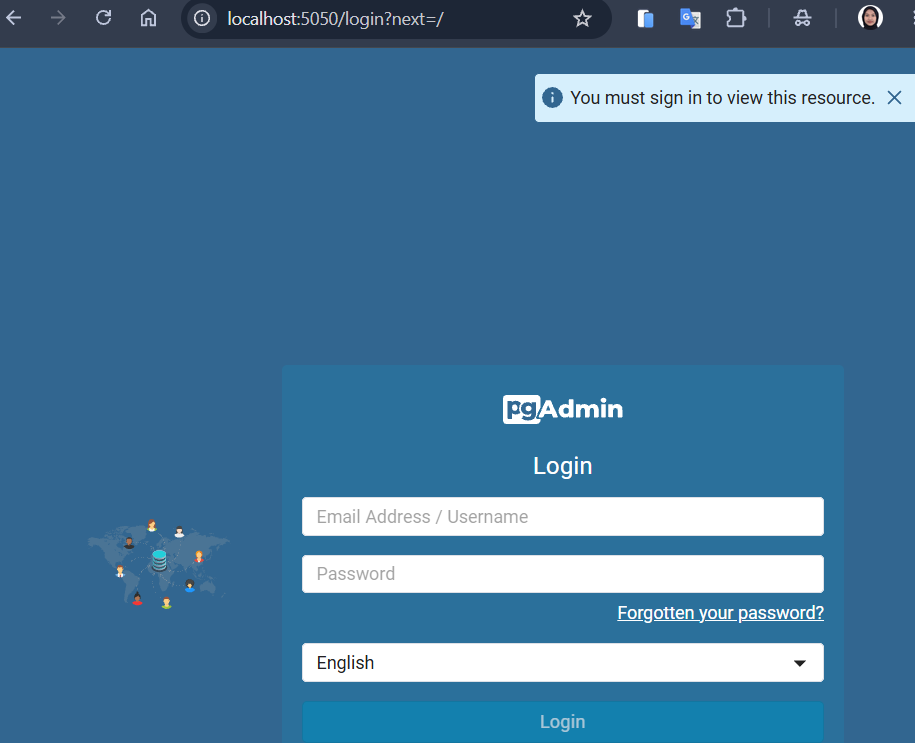

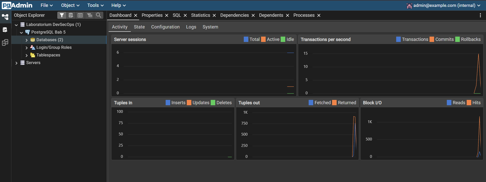

### 4.11 Menguji Schema dan Data Awal

Memeriksa tabel yang terdaftar dan isi data awal dari dalam container PostgreSQL.

```bash
docker compose exec -T postgres-db \
  psql -U labuser -d labdb \
  -c "\dt"

docker compose exec -T postgres-db \
  psql -U labuser -d labdb \
  -c "SELECT id, nrp, name, created_at FROM students ORDER BY id;"
```

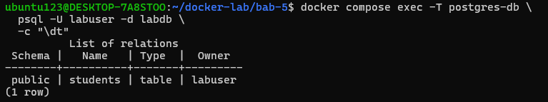

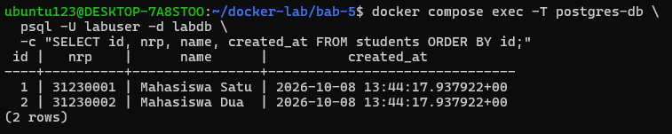

Keluaran menampilkan tabel `students` dan dua baris data awal (`Mahasiswa Satu`, `Mahasiswa Dua`).

### 4.12 Menguji Persistensi Volume

Menambahkan satu record baru, lalu membuat ulang container **tanpa menghapus volume** untuk membuktikan data tetap ada.

```bash
docker compose exec -T postgres-db \
  psql -U labuser -d labdb \
  -c "INSERT INTO students(nrp, name) VALUES ('31230003', 'Mahasiswa Tiga') ON CONFLICT DO NOTHING;"
```

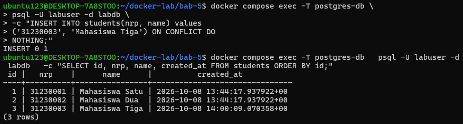

```bash
docker compose down
docker compose up -d
docker compose exec -T postgres-db \
  psql -U labuser -d labdb \
  -c "SELECT nrp, name FROM students ORDER BY nrp;"
```

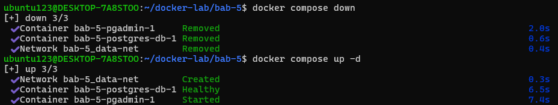

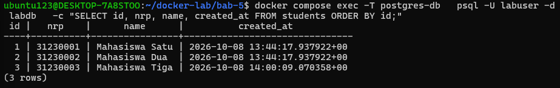

Record `31230003` (Mahasiswa Tiga) tetap tersedia setelah container dibuat ulang, membuktikan data hidup pada volume `pg-data`, bukan pada container.

### 4.13 Backup

Menjalankan script backup, memeriksa file dump yang dihasilkan, dan memverifikasi checksum.

```bash
./scripts/backup.sh
ls -lh backup/
sha256sum --check backup/*.dump.sha256
```

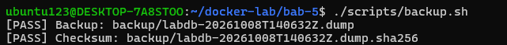

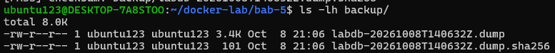

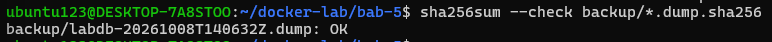

### 4.14 Restore Test

Memilih dump terbaru lalu menjalankan script restore test ke database terpisah `labdb_restore_test`.

```bash
latest_dump="$(find backup -maxdepth 1 -name '*.dump' -type f | sort | tail -n 1)"
./scripts/restore-test.sh "$latest_dump"
```

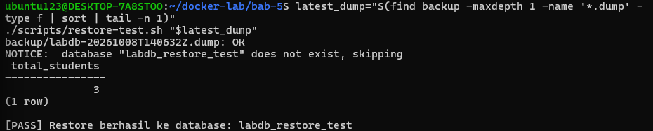


Memeriksa isi database hasil restore untuk memastikan jumlah dan isi record sesuai database sumber.

```bash
docker compose exec -T postgres-db \
  psql -U labuser -d labdb_restore_test \
  -c "SELECT nrp, name FROM students ORDER BY nrp;"
```

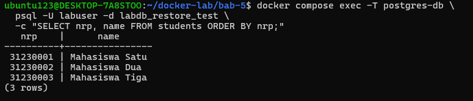

Restore berhasil: database `labdb_restore_test` berisi tiga record yang sama dengan `labdb` (Mahasiswa Satu, Dua, dan Tiga).

### 4.15 Monitoring Dasar

Perintah untuk membuktikan health, versi server, dan penggunaan volume.

```bash
docker compose ps
docker compose logs postgres-db --tail 100
docker compose exec -T postgres-db pg_isready -U labuser -d labdb
docker compose exec -T postgres-db psql -U labuser -d labdb -c "SELECT version();"
docker volume ls
docker system df -v
```

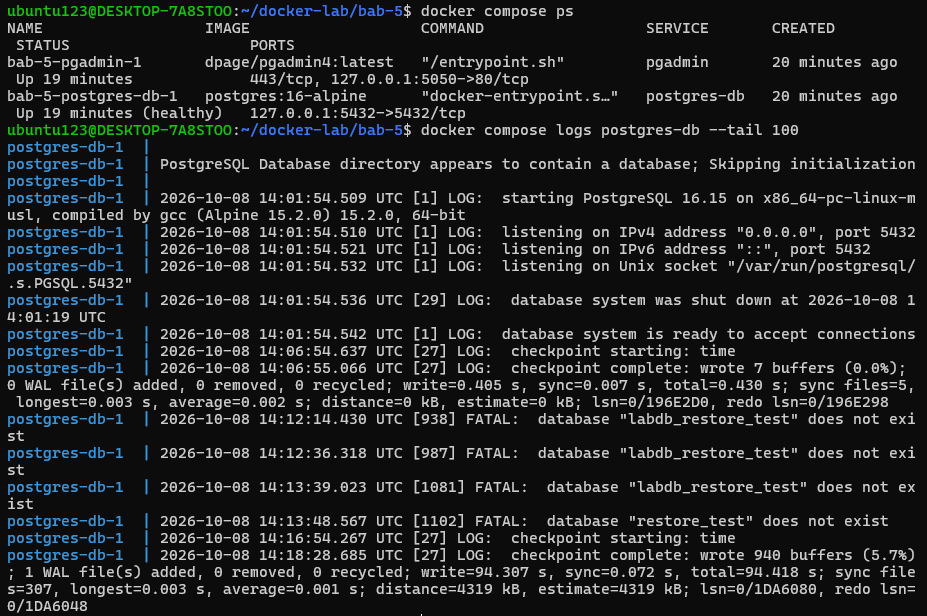

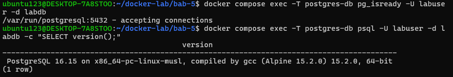

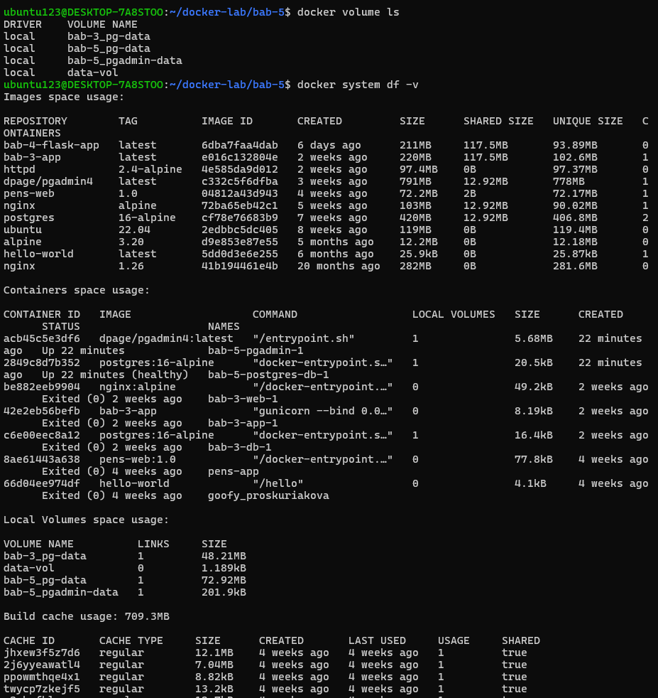

`pg_isready` mengonfirmasi server menerima koneksi, `SELECT version()` menunjukkan versi PostgreSQL yang berjalan, dan `docker volume ls` menampilkan `pg-data` serta `pgadmin-data`.

### 4.16 Checklist PASS

| No | Checklist PASS | Evidence |
| --- | --- | --- |
| 1 | `docker compose config` tidak menghasilkan galat |  |
| 2 | PostgreSQL berstatus `healthy` |  |
| 3 | Tabel `students` dan data awal tersedia |  |
| 4 | pgAdmin dapat terhubung menggunakan hostname `postgres-db` |  |
| 5 | Data tetap tersedia setelah `docker compose down` dan `up` |  |
| 6 | Backup dump berukuran lebih dari nol |  |
| 7 | Checksum backup valid |  |
| 8 | Restore berhasil pada database `labdb_restore_test` |  |
| 9 | Jumlah dan isi record hasil restore sesuai database sumber |  |
| 10 | Credential dan dump tidak masuk repository Git | 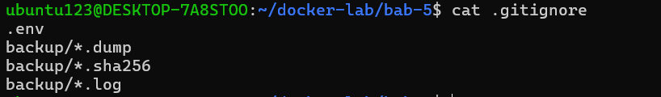 |

Seluruh butir checklist terpenuhi dengan status `PASS`.

### 4.17 Cleanup

Perintah cleanup pertama menghentikan dan menghapus container serta network proyek tetapi **mempertahankan** data pada volume.

```bash
cd ~/docker-lab/bab-5
docker compose down
```

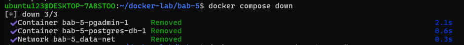

Menghapus database hasil restore test:

```bash
docker compose up -d postgres-db
docker compose exec -T postgres-db \
  dropdb -U labuser --if-exists labdb_restore_test
```

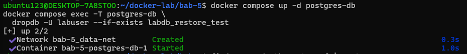

Perintah berikut untuk menghapus volume sekaligus seluruh data PostgreSQL dan pgAdmin.

```bash
docker compose down -v
```

### 4.18 Struktur File Akhir

Susunan file proyek setelah seluruh langkah selesai sebagai dokumentasi hasil akhir.

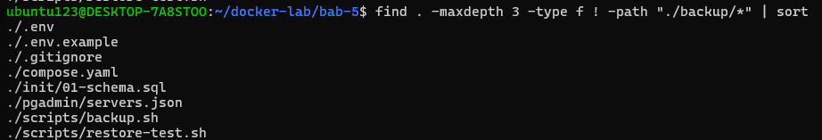

### 4.19 Ringkasan Hasil Eksekusi

| Perintah | Hasil / Catatan | Status |
| --- | --- | --- |
| `docker compose config` | Model Compose valid; hanya `postgres-db` dan `pgadmin` dengan published port loopback | `PASS` |
| `docker compose config --services` | Menghasilkan `pgadmin`, `postgres-db` | `PASS` |
| `docker compose up -d` | 2 container berjalan pada network `data-net` | `PASS` |
| `docker compose ps` | `postgres-db` `healthy`, `pgadmin` `running` | `PASS` |
| `psql -c "\dt"` | Tabel `students` terdaftar | `PASS` |
| `SELECT ... FROM students` | Dua data awal tampil | `PASS` |
| INSERT `31230003` + down/up | Record tetap tersedia setelah container dibuat ulang | `PASS` |
| `./scripts/backup.sh` | Dump format custom + checksum dibuat di `backup/` | `PASS` |
| `sha256sum --check` | Checksum valid (`OK`) | `PASS` |
| `./scripts/restore-test.sh` | Restore sukses ke `labdb_restore_test` | `PASS` |
| SELECT pada `labdb_restore_test` | Jumlah dan isi record sesuai database sumber | `PASS` |
| `pg_isready` / `SELECT version()` | Server menerima koneksi; versi PostgreSQL terverifikasi | `PASS` |
| `docker compose down` | 2 container dan 1 network terhapus, volume dipertahankan | `PASS` |

## 5. Verifikasi

| Skenario Pengujian | Hasil |
| --- | --- |
| PostgreSQL berjalan dengan volume `pg-data` | `PASS` |
| Tabel `students` dibuat otomatis dari init script | `PASS` |
| pgAdmin dapat login dan terkoneksi ke database | `PASS` |
| Data tetap tersedia setelah `docker compose down` dan `up` | `PASS` |
| Backup menghasilkan file dump di direktori host | `PASS` |
| Checksum backup valid | `PASS` |
| Restore sudah diuji ke database terpisah, bukan hanya diasumsikan berhasil | `PASS` |
| Jumlah dan isi record hasil restore sesuai database sumber | `PASS` |
| Credential dan dump tidak masuk repository Git | `PASS` |

## 6. Evaluasi dan Latihan Mandiri

1. Mengapa init script tidak dijalankan ulang saat volume lama masih ada?

2. Apa risiko menaruh password database pada `docker-compose.yml`?

3. Bagaimana cara membuktikan backup dapat dipulihkan?

4. Apa bedanya logical backup `pg_dump` dan backup filesystem volume mentah?

5. Apa dampak `docker compose down -v` terhadap database?

### 6.1 Jawaban

1. Image PostgreSQL hanya menjalankan berkas di /docker-entrypoint-initdb.d Ketika direktori data /var/lib/postgresql/data masih kosong. Volume pd-data yang sudah berisi PostgreSQL menandakan insisalisasi awal sudah selesai, sehingga entrypoint melewati tahap init dan langsung menjalankan server. Jika init script diekseskusi ulang pada data yang sudah ada, operasi seperti CREATE TABLE atau INSERT dapat bertabrakan atau menimpa data nyata.

2. Resiko Utamanya adalah kebocoran credential. Umumnya docker-compose.yml ikut tercomit ke git sehingga password akan ikut masuk ke version control beserta riwayatnya. Password juga akan terekspose lewat docker compose config, docker inspect, dan environment proses container, sehingga orang lain yang memiliki akses repositori dapat membacanya dalam bentuk plaintext. Credential sebaiknya ditaruh di .env yang di .gitignore.

3. Backup dibuktikan dengan verifikasi integritas dump menggunakan checksum SHA-256, lalu dilakukan restore ke basis data terpisah agar tidak menimpa data sumber. Selanjutnya, hasil restore diverifikasi menggunakan kueri SELECT COUNT(*) untuk dibandingkan dengan basis data asal, serta mencatat durasi restore sebagai data RTO.

4. logical backup pg_dump membaca objek database melalui koneksi SQL dan menghasilkan berkas berisi DDL dan data pada snapshot traksaksional. Sedangkan Backup filesystem volume mentah menyalin langsung berkas data postgreSQL di tingka berkas/block.

5. `Dampak dari menggunakan perintah docker compose down -v adalah menghapus container, network proyek, dan karena menggunakan flag -v maka seluruh database dan record ikut terhapus. Data tidak dapat dipulihkan kecuali dari backup.

## 7. Analisis Hasil

### 7.1 Masalah yang Muncul dan Cara Mendiagnosisnya

| Gejala yang Muncul | Langkah Diagnosis | Akar Penyebab | Tindakan yang Diterapkan |
| --- | --- | --- | --- |
| Login pgAdmin di `http://localhost:5050` gagal; email `admin@example.local` ditolak/bersalah format meskipun password benar | Membuka `http://localhost:5050`, mencoba login dengan `PGADMIN_DEFAULT_EMAIL` dan `PGADMIN_DEFAULT_PASSWORD` dari `.env`, lalu memeriksa ulang nilai `.env` dan log container `pgadmin` | Validator email pgAdmin menolak `.local` karena termasuk special-use/reserved domain yang tidak valid;  | Mengganti `PGADMIN_DEFAULT_EMAIL` pada `.env` menjadi `admin@example.com`, lalu menjalankan ulang stack dengan `docker compose up -d` dan login kembali dengan email beserta password baru |

### 7.2 Risiko Keamanan pada Bab Ini

- File .env berisiko bocor jika ter-commit ke Git.
- Isi .env tetap dapat terlihat melalui perintah docker inspect atau docker compose config.
- Volume bukan backup karena tetap rentan terhapus perintah down -v atau mengalami kerusakan storage.
- Script SQL awal hanya dieksekusi sekali saat volume masih kosong.
- File dump di host yang sama rentan hilang total jika terjadi kerusakan disk.

### 7.3 Rekomendasi yang Disarankan untuk Environment Production

1. Mengganti .env dengan secret manager atau Docker secret ber-permission minimalis dan lakukan rotasi credential.
2. Mengelola perubahan skema dengan migration tool terversi yang mendukung uji rollback.
3. Menutup akses published port PostgreSQL jika tidak diperlukan, aktifkan TLS, dan batasi listen_addresses.
4. Menerapkan batasan CPU/RAM pada container serta gunakan connection pooler untuk efisiensi koneksi.
5. Memisahkan peran (role) basis data untuk migrasi, runtime, backup, dan observability.
6. Memantau performa database secara real-time dan hubungkan alert dengan prosedur respon insiden.

## 8. Kesimpulan

Praktikum Bab 5 berhasil menjalankan PostgreSQL dan pgAdmin sebagai container dengan konfigurasi berbasis environment variable, volume persisten, dan init script. Tabel students beserta data awalnya dibuat otomatis pada inisialisasi, dan pgAdmin dapat terhubung menggunakan hostname service postgres-db.

Eksperimen membuktikan data pada volume pg-data tetap persisten saat container dibuat ulang (down & up), namun akan hilang total jika dihentikan menggunakan flag -v (down -v). File dump dari pg_dump tervalidasi via checksum SHA-256 dan berhasil di-restore ke database terpisah labdb_restore_test.

## 9. Catatan Penggunaan AI

Penggunaan AI dalam laporan ini untuk menyusun format laporan, Melakukan generate peta konsep, dan media diskusi untuk memahami materi. Adapun analisis hasil, kesimpulan, dan latihan mandiri dibuat oleh saya sendiri.